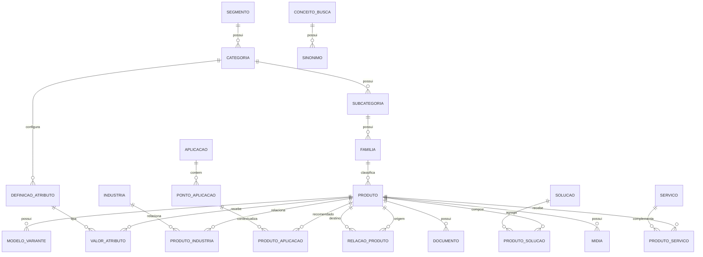

# Auditoria e arquitetura recomendada para o site da GAIATEC SISTEMAS

**Versão:** 1.0 — documento para validação antes do escopo de implementação  
**Data da auditoria:** 27 de agosto de 2026  
**Site auditado:** [gaiatecsistemas.com.br](https://www.gaiatecsistemas.com.br/)  
**Objetivo:** transformar o site em uma plataforma de descoberta de soluções industriais, com um cadastro mestre por produto e vários caminhos de descoberta.

> **Decisão posterior obrigatória:** produtos, serviços, taxonomias, relações, textos, imagens e documentos atuais são considerados inadequados para migração. A remodelagem utilizará banco editorial vazio e recadastro integral pelo novo painel. Este documento usa o site atual apenas para diagnosticar problemas, dimensionar a solução e planejar redirects; qualquer orientação de reaproveitamento de conteúdo foi substituída por essa decisão.

---

## Resumo executivo

O site atual já possui uma identidade visual industrial adequada, páginas de indústrias, aplicações, serviços e alguns bons componentes de página de produto. O principal problema não é estético: é a fragmentação da informação e a baixa capacidade de descoberta.

O usuário encontra estruturas que parecem completas, mas muitos caminhos terminam em páginas genéricas. A busca global, a busca do catálogo e o catálogo de detecção de gases funcionam como sistemas separados. Na auditoria foram encontrados:

- 17 páginas de produtos no catálogo principal;
- 43 páginas de equipamentos em um segundo catálogo, sob `/deteccao-de-gas`;
- 118 rotas internas publicamente alcançáveis;
- apenas 46 URLs no sitemap XML;
- 25 links visíveis na homepage apontando para `#`, portanto sem destino útil;
- uma rota de comparador sem conteúdo principal;
- páginas 404 visuais que respondem HTTP 200 e permitem indexação;
- nove páginas importantes com canonical incorreto apontando para a homepage;
- um inventário mestre no workspace com **1.395 registros de produto/modelo**, muito acima do catálogo público atual.

O resultado é uma experiência que funciona razoavelmente quando o visitante reconhece um dos poucos itens apresentados, mas falha para consultas técnicas compostas, para a navegação por necessidade e para a maior parte do portfólio real.

### Decisão central

Construir uma única base mestre de produtos e relacioná-la a categorias, tecnologias, variáveis, meios, aplicações, indústrias, soluções, serviços e conteúdos. Busca, catálogo, páginas de indústria, páginas de aplicação, comparador e seleção assistida devem consultar essa mesma base.

### Arquitetura de descoberta proposta

| Intenção do visitante                     | Caminho principal            |                    Meta de interação |
| ----------------------------------------- | ---------------------------- | -----------------------------------: |
| Sabe o produto ou modelo                  | Busca global/autocomplete    |                     1 a 2 interações |
| Sabe a variável ou tecnologia             | Catálogo + filtros dinâmicos |                     2 a 4 interações |
| Sabe a necessidade, mas não o equipamento | Seleção assistida            |                      3 a 5 perguntas |
| Sabe onde será utilizado                  | Aplicação                    |       2 a 3 interações até o produto |
| Navega pelo mercado                       | Indústria                    | 2 a 3 interações até solução/produto |
| Precisa de execução técnica               | Serviços                     |                     1 a 2 interações |

### Prioridades

1. **P0 — Fundacional:** cadastro mestre, taxonomia, campos técnicos, relacionamentos e governança.
2. **P0 — Descoberta:** unificar as buscas e os dois catálogos; corrigir rotas sem saída.
3. **P0 — SEO técnico:** 404 real, canonicals, sitemap completo, redirects e renderização rastreável por robôs.
4. **P1 — Experiência:** novo hero com busca, catálogo facetado, páginas de aplicação e indústria orientadas a problemas.
5. **P1 — Conversão:** CTAs contextuais e solicitação técnica levando o contexto da página para o comercial.
6. **P2 — Evolução:** comparador, conteúdo técnico relacionado, personalização por intenção e análise de buscas sem resultado.

---

# A. Diagnóstico do site atual

## A.1 Escopo e método da auditoria

Foram examinados visualmente e funcionalmente a homepage, header, menus desktop e mobile, hero, catálogo, busca global, busca interna de produtos, filtros, páginas de produto, indústrias, aplicações, serviços, biodigestores, detecção de gases, blog, footer, 404, comparador, metadados e sitemap.

Também foi feito um inventário de rotas a partir dos links internos. Foram testadas 118 rotas em desktop e amostras críticas em viewport mobile de 390 × 844 px. A planilha local **Portfolio Mestre - Gaiatec Sistemas.xlsx** foi consultada em modo somente leitura apenas para dimensionar a arquitetura. Ela não será importada automaticamente nem considerada fonte final sem validação item a item.

Esta etapa não substitui uma auditoria de Core Web Vitals com dados de usuários, uma revisão do CMS administrativo ou uma validação jurídica de certificações. Esses itens devem entrar no diagnóstico técnico da implementação.

## A.2 Capacidades observadas que devem ser redesenhadas

| Elemento                | Avaliação                                              | Decisão                                                                                   |
| ----------------------- | ------------------------------------------------------ | ----------------------------------------------------------------------------------------- |
| Identidade visual       | Aparência industrial, tecnológica e B2B                | **Redesenhar e homologar** tokens, hierarquia e contraste; não copiar automaticamente.    |
| WhatsApp e contato      | Acesso comercial visível                               | **Recadastrar e reposicionar** com dados novos aprovados.                                 |
| Mega menu desktop       | Demonstra necessidade de navegação ampla               | **Reconstruir** sobre a taxonomia nova, sem copiar árvore ou links.                       |
| Catálogo com cards      | Demonstra necessidade de lista, ordenação e comparação | **Criar novamente** componentes e filtros sobre o cadastro novo.                          |
| Página de produto       | Indica os tipos de informação esperados                | **Reconstruir** template, campos e relações; conteúdo atual não é referência de correção. |
| Páginas de indústria    | Indicam uma jornada possível                           | **Recriar** com classificação, textos, imagens e relações novas.                          |
| Páginas de aplicação    | Indicam intenção de busca por problema                 | **Recriar** com pontos de atuação e conteúdo comprovado.                                  |
| Estrutura de serviços   | Indica necessidade de agrupamento                      | **Redefinir e recadastrar** integralmente.                                                |
| SEO em páginas modernas | Demonstra intenção de metadados por rota               | **Reimplementar** entrega técnica e conteúdo SEO novo.                                    |
| Conteúdo técnico        | Existe necessidade de artigos e cases                  | **Criar conteúdo novo**, aprovado e com URL própria.                                      |

## A.3 Principais problemas encontrados

### 1. Catálogo fragmentado

Há um catálogo principal com 17 produtos em `/produtos` e outro catálogo especializado com 43 páginas de equipamentos sob `/deteccao-de-gas`. O catálogo principal não pesquisa os equipamentos do segundo catálogo. Isso cria dois modelos de página, duas lógicas de classificação e duas experiências de busca.

**Impacto:** o cliente pode saber o modelo exato, como `S800`, e não encontrá-lo na busca global nem no catálogo principal.

**Decisão:** substituir os silos por um cadastro mestre. `/deteccao-de-gas` deve ser solução, categoria ou landing temática; os equipamentos devem usar a URL canônica única de produto.

### 2. Busca global limitada e inconsistente

A busca no topo possui autocomplete, mas o botão de abertura não tem nome acessível e mede aproximadamente 18 × 22 px. O campo não está disponível no menu mobile.

Resultados observados:

| Consulta             | Comportamento atual                                                |
| -------------------- | ------------------------------------------------------------------ |
| `eletromag`          | Sugere um produto, mas aponta para `/produtos`, não para o produto |
| `ultrassonico vazao` | Nenhuma sugestão                                                   |
| `nível radar`        | Nenhuma sugestão global                                            |
| `h2s`                | Sugere analisador, mas leva ao catálogo genérico                   |
| `DN100 agua`         | Nenhuma sugestão                                                   |
| `Modbus`             | Nenhuma sugestão                                                   |
| `4-20 mA`            | Sugere produto genérico, sem página individual                     |
| `ETA`                | Produz falsos positivos por correspondência de trecho de palavra   |
| `S800`               | Não encontra o produto existente                                   |

Pressionar Enter não conduz a uma página de resultados. A correspondência aparenta usar trechos literais de um conjunto limitado de registros.

**Decisão:** substituir a busca atual por um índice unificado, tolerante a variações e capaz de retornar produtos, famílias, categorias, aplicações, indústrias, soluções, serviços e conteúdo.

### 3. Busca do catálogo também é limitada

A busca em `/produtos` encontra trechos simples, mas não interpreta bem consultas compostas nem dados técnicos.

| Consulta            |                         Resultado atual |
| ------------------- | --------------------------------------: |
| `eletromag`         |                                       1 |
| `ultrasonico vazao` |                                       0 |
| `nivel radar`       |                                       1 |
| `h2s`               |       0, mesmo havendo produtos com H2S |
| `DN100 agua`        |                                       0 |
| `Modbus`            |  0, embora haja Modbus na ficha técnica |
| `4-20 mA`           | 0, embora haja 4–20 mA na ficha técnica |
| `clamp-on`          |                                       2 |
| `ultrassonico`      |               0 por diferença de grafia |

**Decisão:** a busca do catálogo deve ser a mesma busca global, apenas com escopo inicial em produtos e filtros visíveis.

### 4. Filtros não correspondem ao portfólio

O catálogo atual oferece basicamente “Setor” e “Tipo de medição”. Os filtros são estáticos, misturam indústria com tecnologia e não utilizam especificações presentes nas próprias páginas dos produtos.

**Decisão:** adotar filtros facetados e dinâmicos por categoria, usando campos estruturados e contagem de resultados.

### 5. Mega menu parece amplo, mas leva a destinos genéricos

O mega menu desktop é visualmente organizado, porém:

- apresenta apenas três categorias principais: Medição de Vazão, Detecção de Gases e Automação e Controle;
- usa “Saneamento”, “Proteção Catódica”, “HVAC” e “Telemetria” no mesmo filtro de “setor”;
- links como Ultrassônico, Eletromagnético, Coriolis, Turbina e Vortex apontam todos para `/setores/instrumentacao`;
- não oferece busca dentro do menu;
- não representa os seis segmentos e dezenas de categorias do inventário mestre.

**Decisão:** manter o padrão de mega menu, mas trocar seu conteúdo e comportamento.

### 6. Homepage longa e centrada em campanhas, não em descoberta

O hero é um carrossel de campanhas. A mensagem muda automaticamente entre saneamento, biogás, automação e outros temas. Isso comunica amplitude, mas não ajuda o visitante a formular a necessidade. A homepage repete blocos de destaque e possui muitos carrosséis, elevando o esforço de varredura.

Foram encontrados 25 links com `href="#"` na homepage, incluindo serviços, diferenciais, produtos estratégicos, localização, redes sociais e CTAs.

No mobile, o primeiro viewport do hero pode exibir quase somente a fotografia e os controles Prev/Next; título e CTA podem ficar fora da área visível dependendo do slide.

**Decisão:** substituir o carrossel principal por hero estático com busca inteligente. Campanhas estratégicas passam para uma faixa editorial abaixo.

### 7. Cards de destaque não levam ao item anunciado

Os dez produtos em destaque na homepage apontam para `/produtos`, e os três conteúdos técnicos apontam apenas para `/blog`. O usuário precisa procurar novamente aquilo em que acabou de clicar.

**Decisão:** todo card deve apontar para sua entidade canônica: produto, artigo, case, aplicação, serviço ou solução.

### 8. Classificação de “indústrias” mistura conceitos diferentes

O site chama de “indústria/setor” itens de naturezas diferentes:

- indústrias: Saneamento, Gás e Petróleo, Agronegócio;
- soluções/capacidades: Proteção Catódica, Telemetria, Instrumentação;
- disciplinas: HVAC, Controle Ambiental, Segurança Operacional;
- agrupamento genérico: Indústria.

Isso prejudica clareza, filtros e manutenção.

**Decisão:** indústria será uma dimensão de mercado. Se forem validados na remodelagem, Proteção Catódica, Telemetria, HVAC, Controle Ambiental, Instrumentação e Segurança Operacional deverão ser cadastrados no novo modelo como soluções, categorias ou aplicações — sem copiar os registros atuais.

### 9. Páginas de indústria têm boa forma, mas relações fracas

As páginas apresentam introdução, diferenciais, aplicações, produtos e serviços. Porém “Produtos” frequentemente é uma lista de categorias descritivas e “Ver catálogo completo”, em vez de produtos reais vinculados. Serviços específicos muitas vezes levam a `/contato`.

**Decisão:** manter o template comercial, mas alimentar automaticamente seus blocos por relacionamentos estruturados e permitir curadoria editorial.

### 10. Aplicações não representam pontos do processo

A página “Automação de ETA / ETE”, por exemplo, apresenta CLP, SCADA e sensores, mas esses nomes apontam para `/produtos` e não explicam onde, por que ou com qual prioridade cada item é usado.

**Decisão:** criar “Pontos de atuação” dentro da aplicação e relacionar produto × ponto com função, local, justificativa, benefício e prioridade.

### 11. Página de produto é promissora, mas incompleta

Pontos positivos:

- H1, SKU, resumo e CTA visíveis;
- abas de visão geral, especificações, aplicações e mercados;
- produtos relacionados;
- schema Product e BreadcrumbList em parte do catálogo.

Problemas:

- não há breadcrumb visual completo;
- tags de indústria apontam para `/setores`, não para a indústria específica;
- aplicações aparecem como texto, sem ligação direta;
- relacionados não distinguem semelhante, complementar, acessório e substituto;
- serviços relacionados não aparecem;
- documentos, manuais, desenhos e certificados não têm um modelo claro;
- certificações parecem ser blocos reutilizados; cada certificação deve ser comprovada por produto/modelo;
- o schema usa disponibilidade `InStock` de forma genérica, inadequada se não houver dado comercial real;
- os modelos de página do catálogo principal e do catálogo de gás são diferentes.

### 12. Serviços contêm 16 itens, mas a classificação pode ser mais clara

O site organiza os serviços em Instalação, Manutenção, Calibração, Consultoria e Outros. A base é boa, mas há sobreposições. “Plataforma de Controle” é produto/solução digital, não um serviço por natureza. “Controle e Monitoramento” e “Automações” precisam de fronteira clara.

**Decisão:** manter Área de Serviço → Serviço e mover plataforma para Soluções Digitais.

### 13. Footer tem links inconsistentes

Exemplos:

- “Medição de Vazão” aponta para `/setores/instrumentacao`;
- “Automação” aponta para `/setores/industria`;
- redes sociais apontam para `#`;
- “Proteção Catódica” aparece como indústria, produto e serviço;
- não há acesso direto a busca, seleção assistida ou aplicações prioritárias.

### 14. SEO técnico tem falhas críticas

- O HTML inicial entregue pelo servidor é o mesmo shell para diversas rotas, com title e canonical da homepage. Metadados corretos aparecem somente após JavaScript em muitas páginas.
- `/biodigestor`, seis subpáginas de biodigestor, `/blog` e `/contato` usam canonical da homepage.
- O domínio `www` responde diretamente, enquanto os canonicals usam o domínio sem `www`; recomenda-se um redirect 301 para uma única versão.
- O sitemap possui 46 URLs, enquanto a navegação interna revelou 118 rotas; 72 rotas alcançáveis não estão no sitemap.
- As 60 páginas de produto encontradas não aparecem no sitemap atual.
- Páginas antigas `/product-page/...` exibem 404, mas não possuem redirect para sucessoras.
- A página 404 e rotas inexistentes respondem HTTP 200, usam `index, follow` e canonical da homepage: é uma soft 404.
- `/produtos/comparador` responde, mas não apresenta H1 nem conteúdo principal útil.

### 15. Qualidade e prontidão do conteúdo mestre

O inventário mestre possui 1.395 registros distribuídos em seis segmentos:

| Segmento mestre                        | Registros |
| -------------------------------------- | --------: |
| Instrumentação e Controle de Processos |       616 |
| Segurança e Integridade                |       259 |
| Análise Ambiental e de Processos       |       194 |
| Gases, Biogás e Energia                |       179 |
| Inspeção, Localização e Diagnóstico    |       102 |
| Automação, Telemetria e IoT            |        45 |

Categorias com maior volume incluem Proteção Catódica e Corrosão (173), Nível (161), Vazão (160), Biogás e Biometano (151), Pressão (144), Temperatura (111) e Qualidade da Água (106).

O acervo não está pronto para publicação integral sem governança:

- 218 registros têm “Necessita validação” no campo variável/função;
- 799 registros têm tecnologia/princípio não identificado;
- há uma aba com mais de mil inconsistências e pendências;
- vários itens não têm fabricante, marca, datasheet ou imagem validados.

**Decisão:** o schema do CMS deve suportar o futuro acervo, mas cada item será cadastrado novamente. Somente registros novos que passarem por completude e revisão técnica/comercial serão publicados.

## A.4 Matriz de decisão para a remodelagem

| Item atual                          | Decisão                             | Motivo                                                             |
| ----------------------------------- | ----------------------------------- | ------------------------------------------------------------------ |
| Visual industrial e paleta          | Redesenhar sob aprovação            | Manter apenas posicionamento B2B, não os valores atuais por padrão |
| WhatsApp e contato                  | Recadastrar e reconstruir           | Levar dados aprovados e contexto ao atendimento                    |
| Mega menu                           | Reconstruir                         | Criar sobre a nova taxonomia                                       |
| Hero em carrossel                   | Substituir                          | Busca e orientação devem ser a ação central                        |
| Catálogo de 17 produtos             | Substituir                          | Não representa o portfólio                                         |
| Catálogo isolado de detecção de gás | Recadastrar em modelo novo          | Evitar dois cadastros e duas buscas                                |
| Filtro por setor/tipo               | Substituir                          | Campos estáticos e insuficientes                                   |
| Páginas de indústria                | Reconstruir                         | Conteúdo e relações atuais não são confiáveis                      |
| Páginas de aplicação                | Reconstruir                         | Criar decomposição e conteúdo aprovados                            |
| Estrutura de serviços               | Redefinir                           | Não preservar áreas, serviços ou relações atuais                   |
| Blocos de certificação genéricos    | Remover/substituir                  | Exibir apenas evidência por item                                   |
| Links `#`                           | Remover                             | Geram falsa expectativa e páginas sem saída                        |
| Artigos sem URL individual          | Substituir                          | Necessários para SEO e navegação contextual                        |
| “Indústria” genérica                | Reorganizar                         | Usar hub de indústrias de processo ou páginas específicas          |
| Comparador vazio                    | Corrigir ou remover temporariamente | Não pode ser CTA enquanto não funciona                             |

---

# B. Nova arquitetura da informação

## B.1 Princípios

1. A hierarquia técnica existe no dado, mas não obriga o usuário a atravessar cinco telas.
2. Produto tem um único cadastro e uma única URL canônica.
3. Indústria, aplicação, solução e serviço são dimensões relacionadas, não cópias do produto.
4. Busca, catálogo, seleção assistida e relacionamentos usam a mesma fonte.
5. Facetas técnicas são estruturadas; tags são auxiliares.
6. URLs de produtos permanecem estáveis mesmo se a classificação mudar.
7. Nenhuma página deixa o usuário sem próximo passo.

## B.2 Navegação principal recomendada

**Produtos | Soluções e Aplicações | Indústrias | Serviços | Conteúdo Técnico | Empresa | [Fale com um especialista]**

Busca global ampla e visível no desktop; botão de busca com label e acesso persistente no mobile.

### Por que combinar “Soluções e Aplicações” no menu

Os conceitos permanecem entidades separadas, mas podem compartilhar um mega menu:

- **Solução:** oferta integrada da GAIATEC para resolver um problema, como macromedição, telemetria ou detecção de vazamentos;
- **Aplicação:** processo, ativo ou local de uso, como ETA, gasoduto ou biodigestor.

Essa união reduz o número de itens de primeiro nível sem confundir o modelo de dados.

## B.3 Sitemap recomendado

```text
/
├── /busca?q=
├── /selecao-assistida
├── /produtos
│   ├── /produtos/{segmento}
│   ├── /produtos/{segmento}/{categoria}
│   ├── /produtos/{segmento}/{categoria}/{subcategoria}
│   ├── /produtos/familias/{familia}
│   ├── /produtos/{produto-slug}                 ← URL canônica estável
│   └── /comparar?produtos=id1,id2,id3
├── /solucoes
│   ├── /solucoes/monitoramento-redes-estacoes
│   ├── /solucoes/macromedicao
│   ├── /solucoes/deteccao-vazamentos-gas
│   ├── /solucoes/deteccao-vazamentos-agua
│   ├── /solucoes/monitoramento-qualidade-agua
│   ├── /solucoes/automacao-industrial
│   ├── /solucoes/telemetria-monitoramento-remoto
│   ├── /solucoes/protecao-catodica-integridade
│   ├── /solucoes/biogas-biometano
│   ├── /solucoes/analise-emissoes-gases
│   └── /solucoes/hvac-controle-ambiental
├── /aplicacoes
│   ├── /aplicacoes/estacao-tratamento-agua
│   ├── /aplicacoes/estacao-tratamento-esgoto
│   ├── /aplicacoes/estacao-elevatoria-bombeamento
│   ├── /aplicacoes/adutoras-redes-distribuicao
│   ├── /aplicacoes/reservatorios-tanques
│   ├── /aplicacoes/gasodutos-redes-gas-enterradas
│   ├── /aplicacoes/estacao-medicao-regulagem-gas
│   ├── /aplicacoes/poco-valvula
│   ├── /aplicacoes/biodigestores
│   ├── /aplicacoes/plantas-biogas-biometano
│   ├── /aplicacoes/aterros-sanitarios
│   ├── /aplicacoes/refinarias-unidades-processo
│   ├── /aplicacoes/dutos-tanques-protecao-catodica
│   ├── /aplicacoes/monitoramento-emissoes
│   └── /aplicacoes/climatizacao-industrial
├── /industrias
│   ├── /industrias/saneamento
│   ├── /industrias/oleo-gas
│   ├── /industrias/biogas-biometano
│   ├── /industrias/agronegocio
│   ├── /industrias/quimica-petroquimica
│   ├── /industrias/mineracao-metais
│   ├── /industrias/energia-utilities
│   ├── /industrias/alimentos-bebidas
│   └── /industrias/maritima-portuaria
├── /servicos
│   └── /servicos/{servico-slug}
├── /conteudo
│   ├── /conteudo/artigos/{slug}
│   ├── /conteudo/cases/{slug}
│   ├── /conteudo/guias/{slug}
│   ├── /conteudo/webinars/{slug}
│   └── /conteudo/downloads
├── /empresa
│   ├── /empresa/sobre
│   ├── /empresa/qualidade-certificacoes
│   ├── /empresa/parceiros
│   └── /empresa/carreiras
├── /contato
├── /politica-de-privacidade
└── /termos-de-uso
```

## B.4 Taxonomia inicial de produtos

A planilha mestre já valida os seis segmentos abaixo. Eles devem ser a fonte inicial, após revisão de nomes e de registros pendentes.

| Segmento                               | Categorias principais observadas                                                                                                                               |
| -------------------------------------- | -------------------------------------------------------------------------------------------------------------------------------------------------------------- |
| Instrumentação e Controle de Processos | Vazão, Nível, Pressão, Temperatura, Umidade, Densidade, Fluxo de Sólidos, Calibração de Vazão                                                                  |
| Análise Ambiental e de Processos       | Qualidade da Água, Análise de Gases e Emissões, Qualidade do Ar e Odores, Solo e Agricultura, Ruído Ambiental e Ocupacional                                    |
| Segurança e Integridade                | Detecção de Gases, Detecção de Vazamentos, Detecção de Chama, Proteção Catódica e Corrosão, Detecção de Radiação                                               |
| Automação, Telemetria e IoT            | Controle e Indicação, Telemetria e Comunicação, Telemetria de Gás                                                                                              |
| Gases, Biogás e Energia                | Biogás e Biometano, Medição e Controle de Gás, Análise/Qualidade/Condicionamento de Gás, Bombas e Recuperação de Energia, Segurança em Redes de Gás            |
| Inspeção, Localização e Diagnóstico    | Detecção Geofísica, Localização de Ativos Enterrados, Medição de Espessura, Termografia, Vibração e Rotação, Inspeção Visual, Instrumentação Elétrica e Óptica |

### Regra de publicação da hierarquia

O produto possui uma classificação primária:

`Segmento → Categoria → Subcategoria → Família → Produto`

Outros caminhos são relacionamentos, não classificações paralelas. Exemplo: um analisador de biogás pode permanecer em “Análise de Gás” e ser relacionado à solução Biogás, à indústria Biogás e Biometano e à aplicação Biodigestor.

---

# C. Homepage — wireframe textual

## C.1 Sequência recomendada

```text
[Utility bar discreta: telefone | e-mail | localização real]
[Header: logo | Produtos | Soluções e Aplicações | Indústrias | Serviços |
 Conteúdo Técnico | Empresa | busca | CTA Fale com especialista]

[HERO ESTÁTICO]
 H1: Encontre a solução ideal para sua aplicação
 Texto: Instrumentação, análise, automação, segurança e serviços técnicos.
 [Busca ampla: O que você precisa medir, monitorar, detectar ou controlar?]
 [Sugestões contextuais/autocomplete]
 Atalhos: Produtos | Seleção assistida | Aplicações | Indústrias | Serviços

[ENCONTRE SUA SOLUÇÃO]
 Já sabe o produto? | Sabe o que precisa fazer? | Sabe onde será usado? |
 Quer explorar seu setor?

[PRINCIPAIS CATEGORIAS]
 Vazão | Nível | Pressão | Qualidade da água | Detecção de gases |
 Proteção catódica | Telemetria | Biogás
 [Ver todo o catálogo]

[APLICAÇÕES EM DESTAQUE]
 ETA | ETE | Adutoras e redes | Gasodutos | Biodigestores | Plantas de biogás

[SOLUÇÕES INTEGRADAS]
 Macromedição | Monitoramento de redes | Detecção de vazamentos |
 Integridade de dutos | Automação e telemetria

[INDÚSTRIAS]
 6 a 9 cards com links reais, sem carrossel obrigatório

[SERVIÇOS]
 4 áreas + serviços mais procurados

[POR QUE GAIATEC]
 experiência comprovável | engenharia | atendimento nacional |
 rastreabilidade | implantação e pós-venda

[CONTEÚDO TÉCNICO]
 3 itens com URL própria: artigo, guia e case

[CTA FINAL]
 Não encontrou a configuração? Envie sua aplicação para nossa engenharia.
 [Falar com especialista] [Enviar dados da aplicação]

[Footer]
```

## C.2 Ajustes em relação à sequência sugerida

- A busca entra antes de qualquer campanha.
- “Encontre sua solução” vem imediatamente após o hero para atender os quatro perfis.
- Aplicações aparecem antes de indústrias porque descrevem melhor a necessidade operacional.
- Soluções integradas precedem serviços para mostrar capacidade de entrega, não apenas execução.
- Conteúdo técnico fica perto do final, como prova e apoio à decisão.
- Carrosséis deixam de ser padrão. Cards estáticos, grids e listas curadas são mais previsíveis.

---

# D. Hero — estrutura e funcionamento

## D.1 Conteúdo

**H1:** Encontre a solução ideal para sua aplicação  
**Texto de apoio:** Pesquise por produto, variável, tecnologia, fluido, aplicação, modelo ou especificação técnica.

**Placeholder:** “O que você precisa medir, monitorar, detectar ou controlar?”

**Chips de exemplo:** `vazão de água` · `nível por radar` · `H2S` · `clamp-on` · `ETA` · `Modbus`

## D.2 Comportamento da busca no hero

Após dois caracteres, o autocomplete apresenta grupos:

```text
Produtos (3)
  Medidor de Vazão Eletromagnético — modelo X
  Medidor Ultrassônico Clamp-On — família Y

Categorias (1)
  Medição de Vazão

Aplicações (2)
  Macromedição em redes de distribuição
  Medição de vazão na entrada de ETA

Conteúdo técnico (1)
  Como selecionar medidor de vazão para água

[Ver todos os resultados para “vazão de água”]
```

Cada sugestão exibe tipo, título, atributo que gerou a correspondência e destino direto. Exemplo: “Encontrado por comunicação: Modbus”.

## D.3 Desktop

- Busca com 680–760 px de largura.
- H1 e busca permanecem acima da dobra em 1366 × 768.
- Imagem industrial como apoio, com contraste controlado; não compete com o campo.
- Sem autoplay de carrossel.

## D.4 Mobile

- H1, texto, busca e dois atalhos aparecem no primeiro viewport.
- Botão de voz não é necessário na primeira versão.
- Chips em rolagem horizontal opcional.
- Resultados do autocomplete ocupam um painel de altura controlada.
- Acesso à busca persiste no header e no menu.

---

# E. Catálogo — navegação e filtros

## E.1 Página `/produtos`

```text
[Breadcrumb: Início > Produtos]
[H1: Produtos]
[Busca no catálogo]
[Atalhos por segmento]
[Categorias mais acessadas]

[1.395 registros na base | N publicados]
[chips de filtros ativos]                         [Ordenar]

[Filtros]                                        [Lista/Grid de produtos]
 Segmento                                         Card: imagem
 Categoria                                        nome + modelo
 Variável/função                                  3 atributos decisivos
 Meio                                             tags de aplicação/indústria
 Tecnologia                                       comparar | ver produto
 + filtros dinâmicos

[Paginação ou carregar mais com URL rastreável]
[CTA técnico]
```

## E.2 Regras dos filtros

- **OR dentro da mesma faceta:** Tecnologia = Radar OU Ultrassônico.
- **AND entre facetas:** Tecnologia = Radar E Meio = Líquido.
- Contagem em cada opção antes do clique.
- Opções sem resultado ficam desabilitadas ou escondidas conforme contexto.
- Filtros ativos aparecem como chips removíveis.
- “Limpar todos” sempre visível.
- Estado dos filtros permanece na URL para compartilhamento.
- No mobile, filtros abrem em drawer com “Ver N resultados”.
- Não mostrar facetas que não tenham valores na seleção atual.

## E.3 Filtros globais

| Grupo          | Campos                                                        |
| -------------- | ------------------------------------------------------------- |
| Classificação  | Segmento, Categoria, Subcategoria, Família                    |
| Função         | Medir, Monitorar, Detectar, Controlar, Analisar, Automatizar  |
| Variável       | Vazão, Nível, Pressão, Temperatura, Umidade, pH, gases etc.   |
| Meio           | Líquidos, Gases, Sólidos, Vapor e opções técnicas específicas |
| Característica | Tipo, Tecnologia, Instalação, Conexão                         |
| Integração     | Comunicação, Saída, Alimentação                               |
| Conformidade   | Área classificada, certificações comprovadas                  |
| Contexto       | Aplicação, Indústria, Solução                                 |

## E.4 Filtros dinâmicos por categoria

| Categoria         | Facetas específicas prioritárias                                                                                                                         |
| ----------------- | -------------------------------------------------------------------------------------------------------------------------------------------------------- |
| Vazão             | meio/fluido, princípio, DN mínimo/máximo, faixa, instalação, conexão, precisão, pressão, temperatura, alimentação, saída, comunicação, área classificada |
| Nível             | contínuo/pontual, tecnologia, meio, alcance, tipo de tanque, instalação, conexão, temperatura/pressão, saída, comunicação, área classificada             |
| Pressão           | tipo, absoluta/manométrica/diferencial, faixa, conexão, material molhado, precisão, temperatura, saída, comunicação, selo remoto, área classificada      |
| Temperatura       | sensor/princípio, faixa, montagem, haste/poço, conexão, saída, comunicação, proteção                                                                     |
| Qualidade da água | parâmetro medido, online/portátil, princípio, faixa, amostragem, limpeza, comunicação, proteção                                                          |
| Detecção de gases | gás detectado, fixo/portátil/móvel, número de gases, princípio do sensor, faixa, limite, tempo de resposta, comunicação, classificação de área           |
| Telemetria        | protocolo de campo, rede celular/rádio/LoRa/satélite, entradas/saídas, alimentação, bateria, grau de proteção, armazenamento, compatibilidade            |
| Proteção catódica | tipo de sistema/componente, material, faixa elétrica, ambiente terrestre/marinho, monitoramento, comunicação, norma                                      |
| Biogás            | etapa do processo, capacidade, composição do gás, tecnologia, material, pressão/temperatura, automação, uso final                                        |
| Inspeção          | método, ativo inspecionado, alcance, resolução, portátil/online, registro, comunicação                                                                   |

## E.5 Cards de produto

Mostrar apenas dados que ajudam a decidir:

- nome comercial padronizado;
- modelo/família;
- imagem validada;
- categoria;
- três atributos decisivos definidos pela categoria;
- badges no máximo dois;
- ação “Ver produto”;
- ação secundária “Comparar”.

Não usar indústria como badge principal em todos os cards. Indústria é contexto, não especificação.

---

# F. Busca inteligente

## F.1 Escopo do índice

A busca consulta simultaneamente:

- nome do produto e nome comercial;
- modelo, código e SKU;
- segmento, categoria, subcategoria e família;
- descrição curta e completa;
- variável/função;
- tecnologia e princípio;
- meio/fluido;
- instalação e conexão;
- faixa, DN e demais valores técnicos estruturados;
- comunicação, saída e alimentação;
- gases/parâmetros detectados;
- aplicações, pontos da aplicação e indústrias;
- soluções e serviços relacionados;
- sinônimos, siglas, termos antigos e termos comerciais;
- artigos, cases, guias e documentos indexáveis.

## F.2 Normalização

1. minúsculas;
2. remoção controlada de acentos para busca, preservando exibição;
3. normalização de hífen, espaços e símbolos;
4. singular/plural e flexões comuns em português;
5. equivalência de unidades e formatos: `DN 100`, `DN100`; `4–20 mA`, `4-20ma`;
6. siglas e sinônimos: `H₂S`, `H2S`, `gás sulfídrico`, `sulfeto de hidrogênio`;
7. grafias técnicas: `ultrassônico`, `ultrasonico`, `ultrasônico`;
8. correspondência parcial por token;
9. tolerância a erro apenas em termos suficientemente longos;
10. preservação de modelos e códigos como tokens exatos.

## F.3 Dicionário de sinônimos

O dicionário deve ser uma entidade administrável, não código fixo. Exemplos:

| Termo pesquisado    | Conceito normalizado             |
| ------------------- | -------------------------------- |
| eletromag           | eletromagnético                  |
| clamp on, clamp-on  | instalação externa não intrusiva |
| ETA                 | estação de tratamento de água    |
| ETE                 | estação de tratamento de esgoto  |
| H2S, gás sulfídrico | sulfeto de hidrogênio            |
| OD                  | oxigênio dissolvido              |
| vazao, fluxo        | vazão, conforme contexto         |
| mod bus             | Modbus                           |
| nível radar         | medição de nível por radar       |

## F.4 Relevância sugerida

| Sinal                                   | Peso relativo |
| --------------------------------------- | ------------: |
| Modelo/SKU exato                        |            12 |
| Nome do produto exato                   |            10 |
| Família/categoria/subcategoria          |             8 |
| Variável, tecnologia, gás ou parâmetro  |             7 |
| Aplicação e solução                     |             6 |
| Meio, instalação, conexão e comunicação |             5 |
| Sinônimo validado                       |             5 |
| Descrição e benefícios                  |             2 |
| Tag livre                               |             1 |

Regras adicionais:

- correspondência exata sobe antes da aproximada;
- produtos publicados e ativos sobem antes de arquivados;
- restrições técnicas incompatíveis eliminam o produto, não apenas reduzem a pontuação;
- produtos estratégicos podem receber pequeno boost editorial, nunca superar incompatibilidade técnica;
- popularidade ajuda no desempate, não define sozinha a relevância.

## F.5 Página de resultados

Abas: **Tudo | Produtos | Categorias | Aplicações | Indústrias | Serviços | Conteúdo**.

Cada resultado mostra o trecho/atributo que justificou a resposta. A URL mantém `?q=` e filtros. Pesquisas internas usam `noindex, follow` por padrão.

## F.6 Sem resultado exato

```text
Não encontramos uma configuração exata para “DN100 água Modbus”.

Correspondências próximas
  3 medidores de vazão para água com faixa de diâmetro compatível

Categorias relacionadas
  Vazão | Nível | Qualidade da água

Aplicações relacionadas
  ETA | Adutoras e redes | Reservatórios

[Remover o critério Modbus]
[Limpar filtros]
[Enviar aplicação para a engenharia]
```

## F.7 Governança e analytics

Registrar de forma anonimizada:

- consulta;
- resultados exibidos;
- resultado clicado;
- filtros aplicados;
- consultas sem resultado;
- consultas refinadas;
- conversão em contato.

Um relatório mensal deve alimentar sinônimos, conteúdo ausente e priorização de cadastro.

---

# G. Seleção Assistida

## G.1 Princípio

Fluxo adaptativo com no máximo 3 a 5 perguntas na maioria dos casos. Perguntas surgem somente quando dividem significativamente o conjunto de candidatos.

## G.2 Fluxo geral

```text
1. O que você precisa fazer?
   Medir | Monitorar | Detectar | Controlar | Analisar | Automatizar

2. Qual variável ou necessidade?
   Vazão | Nível | Pressão | Temperatura | Gases | Qualidade da água |
   Integridade/corrosão | Vazamentos | Outro

3. Qual é o meio ou ativo?
   Água | Efluente | Outro líquido | Gás natural | Biogás | Ar | Vapor |
   Sólidos | Duto | Tanque | Solo | Não sei

4. Pergunta discriminante por categoria
   Ex.: instalação sem corte? gás específico? faixa/DN? fixo ou portátil?

5. Resultado
   Recomendados | Compatíveis com ressalva | Precisam de informação adicional
```

## G.3 Ramos exemplares

### Vazão

1. Líquido, gás, vapor ou sólido?
2. Tubulação cheia? O fluido é condutivo?
3. Faixa de diâmetro/DN.
4. Pode cortar/parar a tubulação?
5. Precisão/comunicação somente se necessário.

### Detecção de gases

1. Qual gás ou risco?
2. Uso fixo, portátil, móvel ou monitoramento remoto?
3. Um gás ou multigás?
4. Área classificada?
5. Faixa/limite e comunicação quando discriminantes.

### Nível

1. Líquido ou sólido?
2. Medição contínua ou ponto de alarme?
3. Tanque aberto/fechado e condições de pressão/temperatura.
4. Espuma, vapor, agitação ou contato permitido?

## G.4 Lógica do resultado

- **Elegibilidade:** critérios obrigatórios estruturados.
- **Pontuação:** preferências e adequação.
- **Explicação:** gerada a partir dos campos que realmente coincidiram.
- **Ressalva:** informação ainda necessária para especificação final.

Exemplo:

> **Recomendado: Medidor de Vazão Ultrassônico Clamp-On**  
> Adequado porque o meio é água, a instalação deve ser externa e a tubulação não pode ser interrompida. Confirmar material da tubulação, espessura e faixa de vazão antes da seleção final.

A inteligência artificial pode interpretar a frase inicial e redigir a explicação, mas a elegibilidade técnica deve vir de regras e dados estruturados revisados.

---

# H. Indústrias

## H.1 Lista recomendada e validação

A lista abaixo é apenas uma hipótese de arquitetura produzida durante a auditoria. Nenhuma indústria está automaticamente validada pelo site atual ou pela planilha. Comercial e Engenharia devem aprovar novamente nome, escopo, evidências, produtos e aplicações antes do recadastro.

| Indústria              | Status recomendado         | Observação                                                          |
| ---------------------- | -------------------------- | ------------------------------------------------------------------- |
| Saneamento             | Candidato ao primeiro lote | Exige validação e conteúdo novo                                     |
| Óleo e Gás             | Candidato ao primeiro lote | Nome e redirect devem ser aprovados                                 |
| Biogás e Biometano     | Candidato ao primeiro lote | Exige validação do portfólio real                                   |
| Agronegócio            | Candidato ao primeiro lote | Exige validação do portfólio real                                   |
| Química e Petroquímica | Publicar após curadoria    | Validada pelo texto institucional e aplicações                      |
| Mineração e Metais     | Publicar após curadoria    | Validada institucionalmente; precisa de página comercial própria    |
| Energia e Utilities    | Publicar após curadoria    | Validada institucionalmente e por telemetria/recuperação de energia |
| Marítima e Portuária   | Publicar após curadoria    | Validada institucionalmente e por proteção catódica marinha         |
| Alimentos e Bebidas    | Condicional                | Confirmar clientes, cases e famílias realmente ofertadas            |

Não publicar como indústria: Proteção Catódica, HVAC, Controle Ambiental, Segurança Operacional, Instrumentação e Telemetria.

## H.2 Relacionamento produto × indústria

Relação N:N, sem duplicação. O relacionamento armazena:

- produto;
- indústria;
- relevância/prioridade;
- evidência ou justificativa;
- status de validação;
- observação comercial opcional.

As páginas de indústria consultam produtos publicados e validados. Curadores podem fixar destaques sem duplicar cadastro.

## H.3 Wireframe da página de indústria

```text
[Breadcrumb]
[Hero: indústria + proposta específica + CTA]
[Resumo e prova de atuação]
[Principais desafios do setor]
[Mapa de processos/aplicações]
[Soluções GAIATEC por desafio]
[Produtos relacionados filtráveis por categoria]
[Serviços relacionados]
[Aplicações específicas]
[Case / conteúdo técnico / downloads]
[CTA: falar com especialista do setor]
```

Cada bloco deve responder “qual problema é resolvido?” antes de listar equipamentos.

---

# I. Aplicações

## I.1 Estrutura de descoberta

Aplicações podem ser exploradas por ativo/processo e filtradas por indústria, variável ou objetivo. A lista inicial deve combinar aplicações já existentes com ativos centrais revelados pelo portfólio.

### Saneamento

- Estação de Tratamento de Água — ETA;
- Estação de Tratamento de Esgoto — ETE;
- estações elevatórias e sistemas de bombeamento;
- adutoras e redes de distribuição;
- reservatórios e tanques;
- macromedição e controle de perdas;
- qualidade da água e efluentes;
- detecção de vazamentos de água;
- telemetria de estações remotas.

### Óleo, gás e redes

- gasodutos e redes de gás enterradas;
- estação de medição e regulagem;
- poço de válvula;
- detecção móvel de vazamentos;
- monitoramento online de gás;
- tanques de armazenamento;
- refinarias e unidades de processo;
- monitoramento de H2S;
- proteção catódica e inspeção de revestimento.

### Biogás e biometano

- biodigestores;
- plantas de biogás;
- aterros sanitários;
- preparação de substrato;
- dessulfurização e remoção de umidade;
- análise de composição;
- upgrading de biometano;
- armazenamento e queima;
- geração de energia e uso térmico;
- automação e telemetria.

### Indústria, ambiente e integridade

- tanques e dutos industriais;
- monitoramento de emissões;
- climatização industrial;
- fluxo de sólidos;
- monitoramento de vibração e temperatura;
- inspeção de espessura e termografia;
- estruturas marítimas/portuárias.

## I.2 Entidade “Ponto da aplicação”

Exemplo de ETA:

| Ponto                 | Necessidade                  | Variável               | Produto/solução                         | Função              | Benefício                              |
| --------------------- | ---------------------------- | ---------------------- | --------------------------------------- | ------------------- | -------------------------------------- |
| Entrada de água bruta | contabilizar volume captado  | Vazão                  | Medidor eletromagnético ou ultrassônico | medição contínua    | balanço hídrico e controle operacional |
| Mistura/coagulação    | controlar dosagem            | pH, vazão              | analisador de pH + vazão                | realimentar dosagem | estabilidade e menor consumo químico   |
| Filtração             | acompanhar perda de carga    | Pressão diferencial    | transmissor de pressão diferencial      | indicar saturação   | otimizar retrolavagem                  |
| Saída da ETA          | comprovar qualidade e volume | cloro, turbidez, vazão | analisadores + medidor                  | monitoramento final | conformidade e rastreabilidade         |
| Reservatório          | evitar transbordo e falta    | Nível                  | radar/hidrostático                      | nível contínuo      | segurança e planejamento               |

Os produtos finais devem ser escolhidos a partir do cadastro publicado. A tabela acima descreve o modelo de conteúdo, não uma especificação fechada.

## I.3 Wireframe da página de aplicação

```text
[Breadcrumb]
[Hero: aplicação + resumo + indústrias relacionadas]
[Como funciona o processo — breve]
[Desafios e riscos]
[Diagrama ou navegação por etapas]

[Onde podemos atuar?]
  Etapa/Ponto 1
    necessidade | variável | produto/solução | função | benefício técnico |
    benefício operacional | Ver produto
  Etapa/Ponto 2...

[Produtos recomendados]
[Soluções integradas]
[Serviços relacionados]
[Aplicações semelhantes]
[Conteúdo técnico/case]
[CTA: enviar dados da aplicação]
```

---

# J. Serviços

## J.1 Estrutura simplificada recomendada

### Engenharia e Implantação

- Projetos;
- Instalação e Comissionamento;
- Automação e Integração;
- Testes FAT/SAT, hermeticidade e estanqueidade.

### Medições e Metrologia

- Medições em Campo;
- Calibração Rastreável em Laboratório;
- Calibração Rastreável em Campo.

### Manutenção e Integridade

- Manutenção Preventiva e Corretiva;
- Proteção Catódica;
- Inspeção de Revestimentos;
- Detecção de Vazamento de Gás;
- Detecção de Vazamento de Água.

### Monitoramento e Suporte

- Controle, Monitoramento e Telemetria;
- Consultoria e Inspeções Técnicas;
- Locação e Comodato de Equipamentos.

Se a oferta “Plataforma de Controle” for validada, deverá ser cadastrada novamente em `/solucoes/plataforma-monitoramento`, podendo relacionar um serviço novo de implantação/suporte.

## J.2 Página de serviço

```text
[Breadcrumb]
[H1 + promessa objetiva + CTA]
[Quando contratar]
[Escopo incluído]
[Entregáveis]
[Normas/certificações aplicáveis]
[Etapas de execução]
[Produtos, aplicações e indústrias relacionadas]
[Cases/provas]
[FAQ]
[Solicitar avaliação]
```

---

# K. Modelo de dados e CMS

## K.1 Visão relacional



## K.2 Entidades principais

### Produto

| Grupo         | Campos                                                                                  |
| ------------- | --------------------------------------------------------------------------------------- |
| Identificação | ID imutável, nome, nome comercial, slug, status, tipo de cadastro                       |
| Comercial     | descrição curta, proposta de valor, benefícios, diferenciais, disponibilidade comercial |
| Classificação | segmento, categoria, subcategoria, família                                              |
| Técnica       | variável/função, tecnologia, meio, instalação, conexão e valores de atributos dinâmicos |
| Marca         | fabricante original, marca comercial, país, exclusividade se comprovada                 |
| Busca         | nome alternativo, termos técnicos, palavras-chave, sinônimos associados                 |
| Conteúdo      | descrição completa, princípio, limitações, aplicações, imagens, vídeos                  |
| SEO           | title, description, H1, canonical, OG image, dados estruturados                         |
| Governança    | owner, origem, evidência, revisão técnica, revisão comercial, data de revisão           |

### Modelo/variante

Campos: ID/SKU, modelo, código comercial, faixa, dimensões, atributos que variam, documentos, status e ordenação.

**Regra:** agrupar modelos em uma página quando variam apenas em faixa, tamanho, comunicação ou configuração. Criar páginas separadas quando intenção de busca, tecnologia, função ou posicionamento comercial forem materialmente diferentes.

### Definição de atributo

| Campo                | Uso                                                    |
| -------------------- | ------------------------------------------------------ |
| nome e chave técnica | `diametro_nominal`, `gas_detectado`                    |
| categoria aplicável  | define onde aparece                                    |
| tipo de dado         | enum, multi-enum, número, faixa, booleano, texto curto |
| unidade              | mm, bar, °C, ppm, %vol etc.                            |
| valores controlados  | lista administrável                                    |
| uso                  | filtro, comparação, busca, ficha técnica               |
| prioridade           | ordem no filtro/card/tabela                            |
| validação            | obrigatório, intervalo permitido, cardinalidade        |

### Produto × aplicação

Campos obrigatórios:

- produto;
- aplicação;
- ponto/etapa da aplicação;
- função naquela aplicação;
- local de instalação;
- motivo da recomendação;
- benefício técnico;
- benefício operacional;
- prioridade;
- condições/limitações;
- observação técnica;
- status de validação.

### Produto × produto

`tipo_relacao`: semelhante, alternativa tecnológica, complementar, acessório, componente, substituto, versão, requer, incompatível.

### Documento

Tipo, título, arquivo/URL, idioma, revisão, validade, modelo aplicável, status, data, direito de uso e visibilidade. Separar ficha comercial, datasheet oficial, manual, certificado, desenho e software.

## K.3 Tags versus dados estruturados

| Informação  | Estruturada?           | Exemplo              |
| ----------- | ---------------------- | -------------------- |
| Indústria   | Sim                    | Saneamento           |
| Aplicação   | Sim                    | ETA                  |
| Meio        | Sim                    | Líquido/água         |
| Variável    | Sim                    | Vazão                |
| Comunicação | Sim                    | Modbus RTU           |
| DN          | Sim, faixa numérica    | DN 15–3000           |
| Sinônimo    | Entidade controlada    | macromedição         |
| Tag livre   | Apenas apoio editorial | baixa perda de carga |

## K.4 Painel administrativo

### Edição do produto

1. Identificação e status;
2. classificação primária em selects encadeados;
3. atributos técnicos carregados pela categoria;
4. modelos/variantes;
5. indústrias, aplicações, soluções e serviços em multiselect;
6. produtos relacionados com tipo de relação;
7. busca e sinônimos;
8. conteúdo e benefícios;
9. mídia e documentos;
10. SEO e preview;
11. validação e histórico.

### Workflow

`Rascunho → Dados incompletos → Revisão técnica → Revisão comercial → Aprovado → Publicado → Arquivado`

Bloqueios de publicação por categoria:

- nome, modelo/identificador e classificação;
- descrição curta;
- imagem com direito de uso;
- atributos mínimos da categoria;
- fabricante/marca quando aplicável;
- ao menos uma aplicação ou justificativa comercial;
- revisão técnica;
- SEO básico;
- documentos obrigatórios quando houver alegação de certificação.

## K.5 Índice de busca

O CMS continua sendo a fonte da verdade. Um processo publica documentos desnormalizados no índice de busca. Cada alteração aprovada reindexa apenas a entidade afetada e seus relacionamentos.

Campos numéricos e filtros permanecem tipados. Texto livre não deve ser usado para filtrar DN, faixa, comunicação ou gás detectado.

---

# L. Página de produto — wireframe completo

```text
[Breadcrumb completo]
 Produtos > Segmento > Categoria > Subcategoria > Família > Produto

[Galeria validada]             [Categoria / Família]
                               [H1 Nome do produto]
                               [Modelo / SKU]
                               [Resumo]
                               [3–5 atributos decisivos]
                               [Solicitar cotação]
                               [Falar com especialista]
                               [Comparar]

[Navegação âncora]
 Visão geral | Especificações | Modelos | Aplicações | Downloads

[Benefícios e diferenciais]
[Princípio de funcionamento]
[Tabela técnica dinâmica por categoria]
[Tabela de modelos/variantes]
[Aplicações — cards com função e motivo]
[Indústrias]
[Soluções relacionadas]
[Produtos semelhantes]
[Produtos complementares e acessórios]
[Serviços relacionados]
[Documentos e downloads com revisão]
[Certificações comprovadas]
[Conteúdo técnico e cases]
[CTA técnico com contexto pré-preenchido]
```

### Regras de UX

- CTA primário único por faixa de tela.
- Barra de CTA sticky no mobile, sem ocultar conteúdo.
- Tabelas responsivas por blocos ou rolagem horizontal indicada.
- Comparação limitada a produtos da mesma família/categoria comparável.
- A explicação da aplicação não pode ser apenas uma lista de nomes.
- Breadcrumb usa a classificação primária, independentemente do caminho de entrada.
- Parâmetros da origem podem preservar contexto, mas nunca criar outra URL canônica.

---

# M. Página de aplicação — wireframe completo

```text
[Breadcrumb: Início > Aplicações > Aplicação]
[H1 + resumo + indústrias relacionadas]
[CTA: avaliar esta aplicação]

[Visão do processo]
[Principais desafios]
[Etapas/pontos navegáveis]

[Ponto de atuação]
 Necessidade
 Variável/função
 Produto ou solução
 Função do instrumento
 Por que é recomendado
 Benefício técnico
 Benefício operacional
 Condições/limitações
 [Ver produto]

[Repetir por ponto]
[Soluções integradas]
[Produtos relacionados]
[Serviços relacionados]
[Aplicações semelhantes]
[Conteúdo/case]
[CTA: enviar dados para engenharia]
```

---

# N. Página de indústria — wireframe completo

```text
[Breadcrumb: Início > Indústrias > Indústria]
[Hero específico do mercado]
[Resumo + prova de experiência + CTA]

[Principais desafios]
[Mapa de processos e ativos]
[Aplicações da indústria]
[Soluções GAIATEC por desafio]
[Produtos relacionados com filtro por categoria]
[Serviços relacionados]
[Cases e resultados comprováveis]
[Conteúdo técnico e normas]
[FAQ]
[CTA: falar com especialista da indústria]
```

As relações alimentam produtos e serviços automaticamente; a equipe comercial controla ordem, destaque e texto contextual.

---

# O. SEO e URLs

## O.1 Convenções de URL

| Entidade  | Padrão                                              |
| --------- | --------------------------------------------------- |
| Segmento  | `/produtos/instrumentacao-controle-processos`       |
| Categoria | `/produtos/instrumentacao-controle-processos/vazao` |
| Produto   | `/produtos/medidor-vazao-eletromagnetico-modelo-x`  |
| Solução   | `/solucoes/macromedicao`                            |
| Aplicação | `/aplicacoes/estacao-tratamento-agua`               |
| Indústria | `/industrias/saneamento`                            |
| Serviço   | `/servicos/calibracao-rastreavel-campo`             |
| Artigo    | `/conteudo/artigos/como-selecionar-medidor-vazao`   |

Produtos usam URL plana e estável. A hierarquia aparece no breadcrumb e nas páginas de categoria. Isso evita alterar a URL quando a taxonomia evolui.

## O.2 Templates SEO

| Página    | Title sugerido                        | H1       |
| --------- | ------------------------------------- | -------- |
| Categoria | `{Categoria}: equipamentos e soluções | GAIATEC` | `{Categoria}`               |
| Produto   | `{Produto} {Modelo}                   | GAIATEC` | `{Produto}`                 |
| Aplicação | `{Solução/necessidade} em {Aplicação} | GAIATEC` | `{Aplicação}`               |
| Indústria | `Soluções para {Indústria}            | GAIATEC` | `Soluções para {Indústria}` |
| Serviço   | `{Serviço} industrial                 | GAIATEC` | `{Serviço}`                 |

## O.3 Requisitos técnicos

- SSR, SSG ou renderização equivalente com title, description, H1, canonical e conteúdo principal no HTML inicial;
- uma única versão de host, com redirect 301 de `www` para sem `www` ou o inverso;
- canonical autorreferente em páginas indexáveis;
- HTTP 404 real para inexistentes e `noindex`;
- HTTP 410 para conteúdo removido sem substituto, quando apropriado;
- sitemap index dividido por produtos, categorias, aplicações, indústrias, serviços e conteúdo;
- sitemap contendo apenas URLs 200, canônicas e indexáveis;
- breadcrumbs visíveis e `BreadcrumbList`;
- `Product`, `Service`, `Article`, `Organization`, `WebSite/SearchAction`, `ItemList` e `FAQPage` somente quando o conteúdo correspondente existir;
- ofertas, estoque e certificações apenas quando verdadeiros e mantidos;
- páginas de busca e combinações arbitrárias de filtros com `noindex, follow`;
- categorias estratégicas com texto útil, não apenas cards;
- links internos contextuais e rastreáveis;
- Open Graph e imagens sociais validadas;
- sitemap e Search Console monitorados após o cutover.

## O.4 Conteúdo e intenção

Páginas de aplicações atendem intenção técnica de problema/processo. Páginas de categoria atendem intenção de produto/tecnologia. Páginas de indústria atendem intenção setorial. Não fundir textos idênticos entre essas entidades.

---

# P. Recadastro e cutover

## P.1 Estratégia

### Fase 0 — Inventário técnico e congelamento

- exportar somente URLs, status, metadados técnicos e indicadores necessários para redirects/SEO;
- registrar tráfego, backlinks, leads e ranking por URL;
- mapear as 118 rotas públicas com sitemap e Search Console;
- não extrair conteúdo, imagens ou IDs para carga do CMS;
- classificar cada URL em redirect, 410, 404 ou manutenção temporária até o cutover.

### Fase 1 — Modelo e governança

- criar entidades e vocabulários controlados;
- definir atributos obrigatórios por categoria;
- definir nomes e relações a partir de fontes novas aprovadas;
- estabelecer owner técnico/comercial;
- definir critérios de origem, direitos e aprovação de novas imagens/documentos.

### Fase 2 — Recadastro no novo painel

- iniciar o banco editorial vazio;
- cadastrar manualmente/guiado cada produto, modelo, serviço e conteúdo aprovado;
- carregar novas imagens a partir de originais autorizados;
- criar relações de aplicação, indústria, solução e serviço no modelo novo;
- registrar fonte, responsável, revisão e data;
- publicar primeiro o lote prioritário completo;
- cadastrar o restante progressivamente, sem páginas vazias.

Não importar a planilha mestre, os arrays do código, as tabelas atuais ou os arquivos de mídia publicados. Essas fontes podem apoiar conferência humana, mas não criar registros automaticamente.

### Fase 3 — Experiência

- implementar busca unificada, catálogo e filtros;
- implementar hero e seleção assistida;
- aplicar templates de produto, aplicação, indústria e serviço;
- criar estados de erro e ausência de resultado.

### Fase 4 — Redirects e SEO

- criar mapa 1:1 de URLs antigas para novas;
- testar cadeia máxima de um redirect;
- corrigir canonicals e sitemap;
- validar dados estruturados;
- garantir HTTP status corretos.

### Fase 5 — QA e lançamento

- teste funcional desktop/mobile;
- teste de busca com conjunto de consultas técnicas;
- revisão técnica de amostras por categoria;
- verificação de links, documentos e formulários;
- crawl pré e pós-lançamento;
- monitoramento diário de 404, leads e buscas sem resultado nas primeiras semanas.

O rollback restaura a versão pública anterior inteira. Ele não copia o conteúdo anterior para o CMS novo, e nenhuma falha deve fazer o novo site consultar dados antigos como fallback editorial.

## P.2 Mapa inicial de redirects

| Origem atual                     | Destino recomendado                                                 |
| -------------------------------- | ------------------------------------------------------------------- |
| `/setores/saneamento`            | `/industrias/saneamento`                                            |
| `/setores/gas-petroleo`          | `/industrias/oleo-gas`                                              |
| `/setores/biogas-biometano`      | `/industrias/biogas-biometano`                                      |
| `/setores/agronegocio`           | `/industrias/agronegocio`                                           |
| `/setores/protecao-catodica`     | `/solucoes/protecao-catodica-integridade`                           |
| `/setores/hvac`                  | `/solucoes/hvac-controle-ambiental`                                 |
| `/setores/controle-ambiental`    | `/solucoes/monitoramento-ambiental`                                 |
| `/setores/seguranca-operacional` | `/solucoes/seguranca-deteccao-gases`                                |
| `/setores/instrumentacao`        | `/produtos/instrumentacao-controle-processos`                       |
| `/setores/telemetria`            | `/solucoes/telemetria-monitoramento-remoto`                         |
| `/deteccao-de-gas`               | `/solucoes/deteccao-vazamentos-gas` ou categoria, conforme intenção |
| `/deteccao-de-gas/**/{produto}`  | `/produtos/{produto-slug}`                                          |
| `/produtos/{id}-{slug}`          | `/produtos/{slug-canonico}`                                         |
| `/biodigestor`                   | `/solucoes/biogas-biometano`                                        |
| `/biodigestor/portes`            | família/categoria de biodigestores                                  |
| `/biodigestor/como-funciona`     | conteúdo técnico canônico                                           |
| `/blog`                          | `/conteudo`                                                         |
| `/post/{slug}`                   | `/conteudo/artigos/{slug}`                                          |
| `/product-page/{slug-antigo}`    | produto sucessor exato; nunca homepage genérica                     |

O mapa final precisa ser produzido a partir de crawl, analytics, Search Console e inventário do CMS. Não usar regras genéricas quando houver risco de enviar produtos diferentes para o mesmo destino.

## P.3 Tratamento de produtos descontinuados

- com substituto: 301 para o sucessor e aviso na página sucessora;
- sem substituto, mas com valor técnico: manter página arquivada, indicar descontinuação e alternativas;
- removido por erro/duplicidade: 301 para cadastro mestre correto;
- removido sem valor ou equivalente: 410.

## P.4 Tratamento de erros

### 404

```text
Não encontramos esta página.
[Buscar produto ou solução]
[Explorar produtos]
[Explorar aplicações]
[Falar com especialista]
```

Deve responder HTTP 404, ser `noindex` e registrar a origem do acesso.

### Produto não publicado

Não renderizar página vazia. Direcionar para família/categoria ou manter página arquivada com alternativas válidas.

### Módulo que falhou

Mostrar conteúdo principal renderizado no servidor, mensagem amigável e tentativa de recarregar somente o componente. Busca e CTA principal não podem depender de um único chunk dinâmico.

### Sem resultados

Oferecer remover filtros, correspondências próximas, categorias e aplicações relacionadas e contato com engenharia.

---

## Critérios de aceite da futura implementação

### Descoberta

- `eletromag`, `ultrassonico vazao`, `nivel radar`, `h2s`, `DN100 agua`, `Modbus`, `4-20 mA`, `clamp-on`, `ETA` e modelos exatos retornam resultados coerentes;
- todo resultado leva à entidade específica;
- os quatro perfis alcançam resultado relevante dentro das metas de interação;
- busca mobile possui a mesma capacidade da desktop.

### Dados

- nenhuma página de produto duplicada por indústria/aplicação;
- todo produto publicado possui ID imutável e URL canônica única;
- atributos decisivos são estruturados e comparáveis;
- relacionamentos produto × aplicação têm justificativa contextual;
- certificações e documentos têm evidência, revisão e validade.

### UX

- hero mostra H1, busca e caminhos rápidos acima da dobra;
- filtros mobile funcionam em drawer e preservam estado;
- nenhuma página termina sem próximo passo;
- links e botões têm labels acessíveis e área de toque adequada;
- carrosséis não são necessários para acessar conteúdo essencial.

### SEO e qualidade

- todas as páginas indexáveis entregam metadados no HTML inicial;
- 404 responde 404 e não é indexável;
- sitemap cobre todas as URLs canônicas publicadas;
- nenhuma URL antiga relevante fica sem redirect;
- canonical, breadcrumb e dados estruturados passam em QA;
- crawl não encontra links `#`, páginas vazias, cadeias de redirect ou canonicals divergentes.

---

## Recomendação para a próxima etapa

Antes do design visual detalhado, validar este documento em um workshop curto com Comercial, Engenharia, Marketing e responsável pelo portfólio. O workshop deve fechar cinco decisões:

1. nomes finais dos seis segmentos e categorias prioritárias;
2. produtos/famílias do primeiro lote de recadastro e publicação;
3. indústrias realmente atendidas e com conteúdo comprovável;
4. aplicações prioritárias para geração de demanda;
5. campos obrigatórios e owners do processo de aprovação.

Depois dessa validação, o escopo pode ser dividido em quatro frentes paralelas: **conteúdo e dados**, **CMS e integrações**, **busca e regras de seleção** e **UX/UI front-end**.

---

## Fontes auditadas

- [Homepage da GAIATEC](https://www.gaiatecsistemas.com.br/)
- [Catálogo atual de produtos](https://www.gaiatecsistemas.com.br/produtos)
- [Indústrias/setores atuais](https://www.gaiatecsistemas.com.br/setores)
- [Aplicações atuais](https://www.gaiatecsistemas.com.br/aplicacoes)
- [Serviços atuais](https://www.gaiatecsistemas.com.br/servicos)
- [Catálogo atual de detecção de gases](https://www.gaiatecsistemas.com.br/deteccao-de-gas)
- [Sitemap XML atual](https://www.gaiatecsistemas.com.br/sitemap.xml)
- `Portfolio Mestre - Gaiatec Sistemas.xlsx` — consultado localmente em modo somente leitura.

---

## Procedimento de implementação relacionado

A execução dos ajustes, da fundação técnica e do painel administrativo deve seguir:

**[Procedimento de ajustes e desenvolvimento do painel administrativo GAIATEC](../50-operacao-entrega/procedimento-ajustes-desenvolvimento-painel-administrativo-gaiatec.md)**

O procedimento combina esta arquitetura de descoberta com a auditoria do CMS e o complemento técnico-operacional, definindo fases, gates e critérios para que catálogo, busca, painel e site sejam implantados como capacidades completas.

O recadastro de produtos, serviços, taxonomias, imagens e documentos deve obedecer:

**[Política de recadastro limpo de conteúdo e mídia GAIATEC](../70-governanca-legal/politica-recadastramento-limpo-conteudo-midia-gaiatec.md)**

O planejamento consolidado para execução no Codex está em:

**[Planejamento executivo de desenvolvimento da remodelagem e do CMS](../10-produto-requisitos/planejamento-executivo-desenvolvimento-remodelagem-cms-gaiatec.md)**
