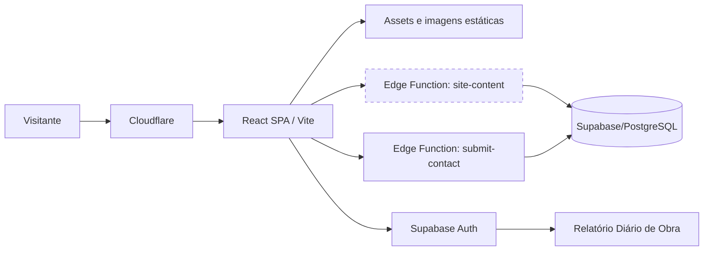
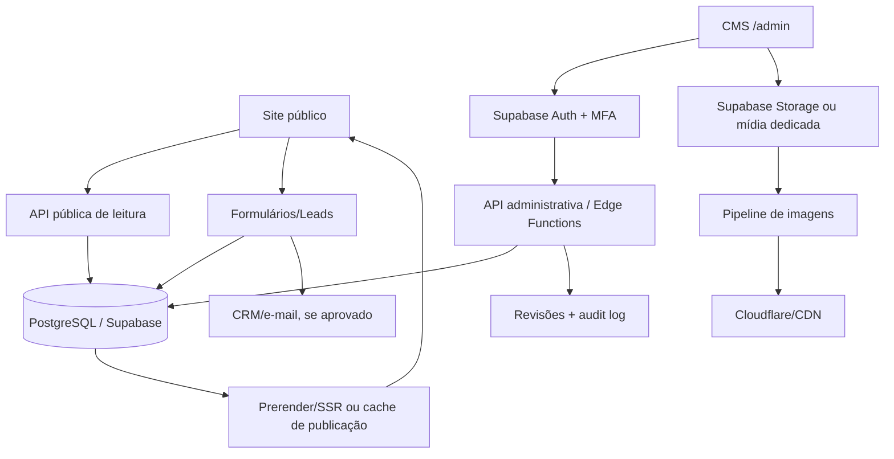
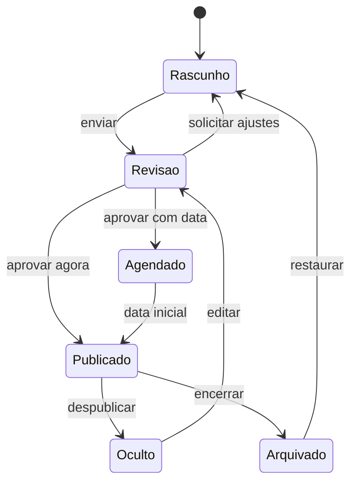

# Auditoria do site atual e arquitetura recomendada para o CMS da GAIATEC SISTEMAS

**Site auditado:** <https://www.gaiatecsistemas.com.br>  
**Data da auditoria:** 27 de agosto de 2026  
**Objetivo:** compreender a arquitetura atual e definir uma evolução segura para uma camada completa de administração de catálogo, conteúdo, mídia, marketing, SEO, leads, usuários e diagnóstico.

> **Atualização:** este documento começou como auditoria externa. O repositório-fonte foi examinado posteriormente; as confirmações, correções e a especificação executável estão na seção 22 e no complemento técnico-operacional vinculado nela.

---

## 1. Resumo executivo

O site atual não precisa ser reconstruído do zero para receber um CMS. A base tecnológica já contém elementos que podem ser aproveitados: React/Vite no frontend, Supabase para autenticação e funções de backend, Cloudflare na borda, rotas organizadas por domínio comercial e um endpoint público de conteúdo que já devolve menus, páginas, serviços, setores, aplicações, posts e configurações.

O problema central é que essas peças ainda não formam um sistema editorial coerente. No bundle publicado, a função responsável por buscar conteúdo dinâmico está neutralizada e sempre devolve o fallback compilado. Por isso, o site público renderiza grande parte do catálogo e do conteúdo diretamente do JavaScript, mesmo havendo dados semelhantes no Supabase. Produtos, serviços, setores, aplicações, blog, menu, homepage e contato possuem fontes duplicadas ou divergentes.

Principais conclusões:

1. **O site é uma SPA React construída com Vite**, usando React Router, componentes Radix UI, ícones Lucide, carrosséis Embla e CSS utilitário/inline consistente com uma base Tailwind.
2. **Supabase já está integrado**. Há Supabase Auth e Edge Functions, ao menos `site-content`, `submit-contact` e `rdo-otp`.
3. **Existe uma base de conteúdo dinâmica**, mas ela não está efetivamente alimentando o site público. A função compilada que deveria executar os carregadores retorna imediatamente os dados de fallback.
4. **Produtos são inteiramente hardcoded** no bundle público atual. Foram identificados 17 produtos compilados com descrição, especificações, aplicações, imagem, categoria e setores.
5. **Há divergência entre banco e frontend**: 16 serviços hardcoded contra 11 retornados pela API, 11 setores hardcoded contra 10 na API e registros evidentemente de teste/indevidos na lista de serviços do backend.
6. **Não existe CMS em `/admin`**. A rota exibe a página 404 da SPA, embora o servidor responda HTTP 200.
7. **Existe um aplicativo autenticado separado em `/relatorio-de-obra`**, com login por senha ou código por e-mail e sessão Supabase. Ele deve ser preservado e isolado do futuro CMS.
8. **Há problemas importantes de SEO e roteamento**: soft 404, canonical e title genéricos em algumas rotas, páginas privadas sem `noindex`, sitemap incompleto e artigos sem páginas individuais.
9. **Há problemas de navegação e responsividade**: vários links usam `#`, cards levam para páginas genéricas em vez de detalhes e a homepage apresentou overflow horizontal em viewport de smartphone.
10. **A melhor estratégia é evolutiva**: sanear os dados, reativar corretamente a camada dinâmica, criar autenticação/RBAC e implantar o CMS por módulos, sem colocar o site público em risco.

### Recomendação principal

Manter React e Supabase, criar o CMS como uma aplicação administrativa separada no mesmo repositório e banco, preferencialmente publicada em `/admin` com bundle, cache e políticas próprios. Se houver liberdade operacional, `admin.gaiatecsistemas.com.br` oferece isolamento adicional. Em qualquer alternativa, segurança deve depender de Supabase Auth, RLS e autorização server-side — nunca da ocultação da rota ou de botões.

---

## 2. Escopo, método e níveis de evidência

Na primeira etapa, de auditoria externa, foram inspecionados:

- homepage em desktop e smartphone;
- rotas de produtos, produto individual, serviços, aplicações, blog, contato, `/admin` e `/relatorio-de-obra/login`;
- HTML, metadados, scripts, folhas de estilo, formulários e links renderizados;
- bundle JavaScript compilado e chunks lazy-loaded publicados;
- `robots.txt`, `sitemap.xml`, `manifest.json` e `sw.js`;
- cabeçalhos HTTP e redirecionamento HTTP → HTTPS;
- endpoint público Supabase `site-content`, usando a credencial anônima já exposta pelo próprio cliente público;
- disponibilidade dos 67 assets JS/CSS referenciados pelo bundle atual.

### Classificação das constatações

| Nível | Significado |
|---|---|
| **Confirmado** | Observado diretamente no site, bundle, resposta HTTP ou API pública. |
| **Inferido com alta confiança** | Conclusão técnica baseada em artefatos públicos, mas sem acesso ao código-fonte ou configuração interna. |
| **Não verificável externamente** | Exige repositório, painel Supabase, Cloudflare, CI/CD ou documentação interna. |

Esta auditoria não realizou alterações no site, submissões de formulário, login, escrita em banco ou testes invasivos.

---

## 3. A. Arquitetura técnica atual

### 3.1 Stack identificada

| Camada | Tecnologia/evidência | Situação |
|---|---|---|
| Frontend | React em SPA | **Confirmado** pelos vendors, componentes e montagem no elemento `root`. |
| Build | Vite | **Confirmado** por chunks com hash, `modulepreload` e runtime `__vite__mapDeps`. |
| Roteamento | React Router com rotas lazy-loaded | **Confirmado** no bundle compilado. |
| UI | Radix UI, Lucide, Embla Carousel | **Confirmado** pelos bundles/imports publicados. |
| Estilo | CSS global, utilitários e muitos estilos inline; padrão compatível com Tailwind | **Inferido com alta confiança**. A configuração fonte não foi acessada. |
| Backend/BaaS | Supabase | **Confirmado** pelo SDK, projeto público, Auth e Edge Functions. |
| Banco | PostgreSQL gerenciado pelo Supabase | **Inferido com alta confiança**, por ser a base do Supabase e pelas respostas da função de conteúdo. O schema não foi exposto. |
| Autenticação | Supabase Auth, senha e OTP por e-mail | **Confirmado** no módulo `/relatorio-de-obra`. |
| APIs | Supabase Edge Functions | **Confirmado** para conteúdo, contato e OTP. |
| CDN/proxy | Cloudflare | **Confirmado** por DNS e cabeçalhos HTTP. O provedor de origem não foi identificado. |
| PWA/cache | Manifest + Service Worker próprio | **Confirmado** por `manifest.json` e `sw.js`. |
| Analytics | Cloudflare Web Analytics beacon | **Confirmado** no HTML. Google Analytics não foi observado. |
| Imagens | Arquivos estáticos no mesmo domínio, com AVIF/WebP responsivos | **Confirmado**. Supabase Storage não foi observado no site público. |

### 3.2 Topologia atual observada



O traço pontilhado representa uma integração existente no código, mas não utilizada na renderização pública atual devido ao carregador desativado.

### 3.3 Estrutura frontend

A aplicação possui um shell público compartilhado com:

- barra superior;
- header e mega menu;
- navegação mobile;
- busca;
- conteúdo da rota;
- formulário de orçamento;
- newsletter;
- footer;
- consentimento de cookies;
- registro do Service Worker.

As páginas são carregadas por chunks separados. Entre os módulos observados estão:

- Sobre;
- Setores e setor individual;
- Serviços e serviço individual;
- Produtos, produto individual e comparador;
- Aplicações e aplicação individual;
- Blog;
- Contato;
- Biodigestor e páginas associadas;
- Detecção de gás e suas categorias/produtos;
- Política de privacidade e termos;
- Relatório Diário de Obra.

### 3.4 Rotas públicas e privadas identificadas

| Grupo | Padrões principais |
|---|---|
| Institucional | `/`, `/sobre`, `/contato`, `/politica-de-privacidade`, `/termos-de-uso` |
| Setores | `/setores`, `/setores/:slug` |
| Produtos | `/produtos`, `/produtos/:slug`, `/produtos/comparador` |
| Serviços | `/servicos`, `/servicos/:slug` |
| Aplicações | `/aplicacoes`, `/aplicacoes/:slug` |
| Conteúdo | `/blog` |
| Biodigestor | `/biodigestor` e sete subrotas |
| Detecção de gás | `/deteccao-de-gas`, categoria e produto |
| App autenticado existente | `/relatorio-de-obra/login`, `/definir-senha`, `/assinar/:token`, `/arquivo`, `/novo`, `/relatorio/:id`, `/equipe` |
| CMS solicitado | `/admin` **não existe**; hoje cai no Not Found da SPA. |

O sitemap publicado contém 46 URLs. Ele não reflete todo o conjunto de rotas realmente disponível.

### 3.5 Backend e APIs

Foram identificadas as seguintes funções:

| Função | Uso observado |
|---|---|
| `site-content` | Leitura de menu, páginas, serviços, setores, aplicações, posts e conteúdo por grupo. |
| `submit-contact` | Recebimento do formulário geral e newsletter. |
| `rdo-otp` | Envio de código de acesso ao módulo Relatório Diário de Obra. |

O frontend contém funções para buscar:

- `type=menu`;
- `type=pagina&slug=...`;
- `type=servicos`;
- `type=setores`;
- `type=aplicacoes`;
- `type=posts`;
- `type=timeline`;
- `type=conteudo&grupo=...`.

Entretanto, o wrapper compilado responsável pelo carregamento retorna o fallback imediatamente e não executa a função assíncrona. Além disso, a chamada codificada para `site-content` não acrescenta o header de autorização exigido pela função. Se o carregador fosse simplesmente reativado sem corrigir essa autenticação pública, a API responderia 401.

### 3.6 Autenticação existente

O módulo Relatório Diário de Obra já implementa:

- sessão Supabase;
- login por e-mail/senha;
- solicitação e verificação de OTP por e-mail;
- logout;
- redirecionamento para login quando não existe sessão;
- leitura de `app_metadata.role === "admin"`.

A proteção de rota observada no frontend verifica apenas a existência da sessão. O papel `admin` é calculado, mas não é aplicado no wrapper geral dessa rota. Isso não prova uma falha de autorização, pois RLS e Edge Functions podem proteger os dados no servidor; porém, essas políticas não puderam ser verificadas externamente.

### 3.7 Banco e conteúdo já existente

A API pública retornou os seguintes conjuntos:

| Conjunto | Quantidade | Campos principais observados |
|---|---:|---|
| Menu | 8 itens raiz | `id`, `parent_id`, `label`, `href`, `ordem`, `abrir_nova_aba`, `icone`, `children` |
| Homepage | 1 página / 5 blocos | metadados da página e blocos `hero_slides`, `cta_banner`, `text_block`, `feature_grid`, `news_grid` |
| Serviços | 11 | `slug`, `titulo`, `overline`, `descricao_curta`, `imagem_url`, `destaque`, `ordem` |
| Setores | 10 | estrutura semelhante a serviços |
| Aplicações | 12 | `slug`, `nome`, `descricao_curta`, `imagem_url`, `icone`, `setores`, `destaque`, `ordem` |
| Posts | 6 | `slug`, `titulo`, `resumo`, `imagem_url`, `tags`, `publicado_em`, autor e categoria |
| Contato | 8 chaves | `chave`, `valor`, `tipo`, `grupo`, `ordem` |

Foram encontrados registros claramente de teste ou impróprios na coleção de serviços do backend. Eles não aparecem no site porque o frontend usa os dados hardcoded. Esse é um bloqueador de publicação dinâmica: o conteúdo deve ser saneado antes de ligar a API ao público.

### 3.8 Armazenamento de mídia

No site público, as imagens são servidas como arquivos do próprio domínio, em caminhos como:

- `/images/home/...`;
- `/images/produtos/...`;
- `/images/servicos/...`;
- `/images/aplicacoes/...`;
- `/images/setores/...`;
- `/images/blog/...`.

Há um componente que gera `srcset` em 480, 1024 e 1920 px e prefere AVIF/WebP. A homepage carregou 44 imagens; 41 usavam lazy loading. O hero é carregado de forma prioritária.

Não foi possível confirmar se os arquivos de origem vivem no repositório, em um bucket, em storage externo ou são copiados durante o deploy. A aplicação pública não demonstrou uso de Supabase Storage para essas imagens.

### 3.9 Service Worker e deploy

O Service Worker aplica:

- cache-first para assets com hash;
- cache-first para fontes;
- stale-while-revalidate para imagens;
- network-first para HTML;
- fallback para o HTML cacheado quando a rede falha.

O mecanismo é razoável para uma PWA, mas exige deploy atômico. Durante a auditoria, resultados indexados por mecanismos de busca registravam falhas antigas de import dinâmico apontando para chunks que já não existem. No momento da verificação, os 67 assets referenciados pelo bundle atual retornaram HTTP 200. O padrão indica risco de HTML antigo apontar para chunks removidos em uma publicação posterior.

---

## 4. B, C e D. Mapa do conteúdo atual

### 4.1 Conteúdo hardcoded, dinâmico e híbrido

| Domínio | Fonte renderizada hoje | Fonte dinâmica existente | Diagnóstico |
|---|---|---|---|
| Homepage | Arrays/objetos no bundle | Página `home` com 5 blocos | Híbrido, mas o dinâmico está desativado. |
| Hero | Fallback compilado | `hero_slides` e conteúdo por grupo | Dinâmico planejado, não efetivo. |
| Menu/header/footer | Estrutura compilada | API de menu e contato | Fonte duplicada. |
| Produtos | 17 produtos compilados | Não foi observado endpoint de produtos no loader atual | Hardcoded e prioritário para migração. |
| Serviços | 16 serviços compilados | 11 serviços na API | Fontes divergentes; banco contém registros de teste. |
| Setores/indústrias | 11 setores compilados | 10 setores na API | Fontes divergentes. |
| Aplicações | 12 aplicações compiladas | 12 aplicações na API | Duplicado; precisa eleger fonte canônica. |
| Blog | 6 posts fallback | 6 posts na API | Duplicado; artigos não possuem rota individual funcional. |
| Sobre | Conteúdo compilado com adaptador para página dinâmica | API de página | Dinâmico desativado. |
| Contato | Fallback compilado | 8 configurações na API | Informações globais duplicadas. |
| Formulário geral | Estado React + POST JSON | Edge Function `submit-contact` | Dinâmico e operacional; persistência final não verificada. |
| Newsletter | Estado React + mesmo endpoint de contato | Edge Function `submit-contact` | Dinâmico e operacional. |
| Relatório de obra | Dados autenticados via Supabase | Supabase Auth/backend | Aplicação separada, não CMS. |
| SEO | Componente por rota + defaults no HTML | Campos SEO na página `home` | Implementação parcial e inconsistente. |
| Imagens | Arquivos estáticos versionados por caminho | URLs no conteúdo dinâmico | Híbrido, sem biblioteca central visível. |

### 4.2 Estrutura hardcoded dos produtos

Os 17 produtos compilados possuem, em linhas gerais:

- identificador numérico;
- categoria;
- nome;
- descrição curta;
- especificação principal;
- imagem;
- setores;
- variável/tipo de medição;
- descrição completa;
- lista de especificações `label/value`;
- aplicações.

O slug é derivado de `id + nome normalizado`. O SKU mostrado no produto é derivado do identificador. Não foram observados no modelo hardcoded:

- status editorial;
- rascunho/revisão/agendamento;
- mídia em galeria administrável;
- documentos;
- sinônimos/palavras-chave;
- relações contextualizadas Produto × Aplicação;
- histórico;
- versão;
- autor/revisor;
- SEO completo por produto;
- atributos dinâmicos por categoria.

### 4.3 Fonte canônica necessária

O CMS não deve tentar manter banco e arrays no código em paralelo. A regra recomendada é:

- **Banco:** fonte canônica de conteúdo e configuração;
- **Storage:** fonte canônica de mídia e documentos;
- **Código:** componentes, schemas, validações, presets e regras de negócio;
- **Cache/SSG:** cópia de leitura derivada, nunca fonte editorial.

---

## 5. E. Problemas existentes e prioridades

### 5.1 P0 — corrigir antes de ativar publicação dinâmica

#### P0.1 — Fontes duplicadas e divergentes

O site usa conteúdo compilado enquanto o Supabase guarda outro conjunto. Ligar a API sem saneamento pode publicar dados incorretos imediatamente.

**Ação:** congelar escrita editorial temporariamente, exportar banco e hardcoded, comparar registro a registro, eliminar testes, aprovar a versão canônica e só então reativar a leitura dinâmica.

#### P0.2 — Registros indevidos na coleção de serviços

Há pelo menos dois registros evidentemente de teste no retorno público da API. Embora invisíveis atualmente, eles podem vazar ao reativar o carregamento.

**Ação:** remover ou arquivar, identificar autor/origem pelo audit log disponível no Supabase, revisar políticas de ambiente e impedir que staging grave em produção.

#### P0.3 — Carregador dinâmico desativado

O wrapper retorna o fallback e ignora a função que faria o fetch. É uma desativação sistêmica: menu, páginas, contato, blog, serviços, setores e aplicações são afetados.

**Ação:** substituir o stub por um cliente tipado com autenticação pública correta, cache, timeout, tratamento de erro e fallback controlado.

#### P0.4 — API de conteúdo exige autorização que o fetch atual não envia

Sem header, `site-content` retorna 401. A função de leitura pública deve aceitar uma credencial anônima válida e devolver apenas conteúdo publicado, ou ser configurada explicitamente como endpoint público com validação interna.

**Ação:** nunca tornar tabelas editáveis públicas. Usar JWT anônimo para leitura publicada, RLS e/ou Edge Function com allowlist de operações.

#### P0.5 — Soft 404

`/admin` e outras URLs inexistentes retornam HTML com HTTP 200 e só depois exibem 404 no cliente. Isso prejudica SEO, monitoramento e cache.

**Ação:** configurar a camada de entrega para responder 404 real quando a rota não existe ou adotar SSR/prerender/edge routing que reconheça o catálogo de rotas.

### 5.2 P1 — alta prioridade

#### SEO inconsistente

Constatações:

- `/produtos`, `/servicos` e produto individual atualizam title/canonical corretamente;
- `/blog` e `/contato` herdaram title e canonical da homepage;
- `/admin` herdou `index, follow` e canonical da home;
- `/relatorio-de-obra/login` também herdou metadados públicos;
- o 404 do cliente está indexável;
- o sitemap não lista os 17 produtos individuais nem os 16 serviços individuais;
- os seis cards de blog não têm páginas individuais e apontam para `#`;
- há JSON-LD de organização duplicado na homepage;
- o `robots.txt` bloqueia `/admin/`, mas não cobre de forma confiável `/admin` sem barra nem `/relatorio-de-obra/`;
- `Disallow` não substitui `noindex` nem autenticação.

**Ação:** criar SEO por entidade, sitemap gerado do banco, canonical por rota, `noindex,nofollow` com header HTTP nas áreas privadas e status HTTP correto.

#### Links incompletos ou quebrados

Exemplos observados:

- Localização e Carreiras no topo usam `#`;
- vários “Ver Serviço” da home usam `#`;
- “Ver todos os 11 setores” usa `#`;
- vários CTAs de destaques usam `#`;
- links sociais usam `#`;
- cards de produto da homepage apontam para `/produtos`, não para o produto;
- cards de blog apontam para `/blog` ou `#`, não para o artigo;
- alguns links “Saiba mais” não possuem destino real.

**Ação:** diagnóstico automatizado de links e exigência de URL válida no CMS antes de publicar CTA/menu/banner.

#### Overflow horizontal no mobile

Em viewport de 390 × 844, o `clientWidth` foi 375 px e o `scrollWidth` chegou a 619 px. O principal causador identificado foi a seção “Soluções Técnicas Integradas”, cujo bloco sticky manteve largura aproximada de 589 px. Carrosséis também mantêm cards fora da viewport, mas deveriam estar totalmente contidos por wrappers com overflow.

**Ação:** remover largura fixa/min-width no breakpoint mobile, limitar `max-width: 100%`, testar todas as seções em 320, 375, 390, 768, 1024 e 1440 px.

#### Tratamento de falha de chunks

Resultados históricos indexados mostraram a tela padrão do React Router para falha de import dinâmico. O live atual está saudável, mas o deploy/cache pode recriar a condição.

**Ação:**

- `ErrorBoundary` por rota;
- `errorElement` amigável;
- uma tentativa controlada de reload em `ChunkLoadError`;
- retenção temporária de assets de releases anteriores;
- deploy atômico;
- versionamento de cache e telemetria de erros.

#### Segurança de headers

Confirmado:

- HTTP redireciona para HTTPS;
- `X-Frame-Options: SAMEORIGIN`;
- `X-Content-Type-Options: nosniff`;
- `Referrer-Policy: strict-origin-when-cross-origin`;
- `Permissions-Policy` presente.

Não observado na resposta principal:

- HSTS;
- Content-Security-Policy;
- Cross-Origin-Opener-Policy;
- Cross-Origin-Resource-Policy.

**Ação:** adicionar HSTS após validar todos os subdomínios, CSP inicialmente em report-only, depois enforce; definir políticas de origem compatíveis com Supabase, fontes e mídia.

### 5.3 P2 — qualidade, acessibilidade e performance

#### Acessibilidade

- há dois links de salto, um em português e outro em inglês;
- controles de carrossel alternam entre rótulos em português e inglês;
- inputs dependem visualmente de placeholders; labels persistentes devem ser confirmadas/corrigidas;
- imagens de produto aparecem duplicadas com ALT terminado em “alt”;
- 10 das 44 imagens da home tinham ALT vazio; parte pode ser decorativa, mas exige classificação;
- o texto do hero mobile apresentou contraste visual baixo em partes da imagem;
- vários links sem destino real prejudicam teclado e leitores de tela.

#### Performance

Pontos positivos:

- AVIF/WebP e `srcset`;
- lazy loading de imagens;
- preload do hero;
- code splitting por rota;
- assets com hash e cache de um ano;
- Service Worker com estratégias separadas.

Pontos de atenção:

- os assets principais preloaded somam aproximadamente 820 mil caracteres decodificados antes dos chunks de rota;
- vendors de Supabase e Radix são carregados globalmente;
- o logo branco usado no header tem cerca de 102 KB e dimensões naturais muito maiores que a exibição;
- muitos estilos inline aumentam o bundle e dificultam tokens administráveis;
- a SPA depende de JavaScript para conteúdo e SEO;
- o Service Worker pode conservar HTML antigo em fallback.

**Ação:** medir com Lighthouse em CI, separar bundle público/admin/RDO, carregar Supabase Auth apenas onde necessário, otimizar logos, estabelecer budgets e considerar prerender/SSR para páginas públicas.

---

## 6. F. Arquitetura recomendada do CMS

### 6.1 Princípios

1. **Evoluir, não reescrever.** Preservar componentes e rotas úteis.
2. **Uma fonte canônica.** Conteúdo aprovado no banco, mídia no storage.
3. **Publicação segura.** Rascunho, revisão, preview e publicação explícita.
4. **Autorização no servidor.** RLS e funções, não apenas UI.
5. **Design governado.** Blocos, presets e tokens; sem canvas livre.
6. **Conteúdo desacoplado da apresentação.** O CMS descreve o conteúdo; o frontend escolhe o componente aprovado.
7. **Auditoria por padrão.** Toda alteração crítica gera revisão e log.
8. **Compatibilidade futura.** Schemas extensíveis por categoria, sem colunas rígidas para cada produto.

### 6.2 Topologia alvo



### 6.3 Organização recomendada

```text
apps/
  public-site/       React público
  admin/             CMS separado, lazy e privado
  rdo/               módulo Relatório Diário de Obra preservado
packages/
  ui/                componentes compartilhados
  content-schema/    tipos, validações e presets
  data-access/       clientes público/admin tipados
  auth/              sessão, RBAC e guards
supabase/
  migrations/
  functions/
  seed/
```

Se o projeto não estiver em monorepo, a mesma separação pode ser aplicada por pastas e entrypoints. O ponto essencial é não incluir todo o CMS no bundle inicial do site público.

### 6.4 Rota administrativa

**Opção recomendada para menor mudança:** `/admin` em entrypoint separado, com:

- `noindex,nofollow,noarchive` por header e meta;
- autenticação antes de qualquer leitura administrativa;
- exclusão explícita do cache do Service Worker público;
- chunk separado;
- Content Security Policy mais restritiva;
- APIs administrativas autenticadas.

**Opção de maior isolamento:** `admin.gaiatecsistemas.com.br`, usando o mesmo Supabase e repositório. Facilita políticas de cache/CSP, mas aumenta a configuração de CORS, cookies e deploy.

### 6.5 Estratégia para o site público

Curto prazo:

- continuar em React SPA;
- corrigir o cliente de conteúdo;
- usar API somente para conteúdo publicado;
- manter fallback estável durante a migração;
- gerar sitemap do banco;
- corrigir metadados por rota.

Médio prazo:

- prerender ou SSR para produtos, serviços, setores, aplicações, páginas e artigos;
- revalidação por publicação;
- status HTTP correto;
- HTML indexável sem depender da execução completa do JavaScript.

Isso pode ser feito preservando componentes existentes; não exige necessariamente migrar tudo para outro framework.

---

## 7. G. Modelo de banco de dados recomendado

### 7.1 Convenções gerais

Todas as entidades editoriais devem compartilhar, quando aplicável:

- `id uuid`;
- `slug` único;
- `status`: `draft`, `review`, `scheduled`, `published`, `hidden`, `archived`;
- `published_at`, `publish_from`, `publish_until`;
- `created_at`, `created_by`, `updated_at`, `updated_by`;
- `deleted_at`, `deleted_by` para lixeira;
- `version` para concorrência otimista;
- campos SEO ou relação 1:1 com SEO;
- restrições de unicidade e integridade no banco.

### 7.2 Identidade e permissões

| Tabela | Finalidade |
|---|---|
| `profiles` | Perfil ligado a `auth.users`: nome, e-mail de exibição, status, último acesso. |
| `roles` | Super Admin, Admin, Comercial, Marketing, Técnico, Editor. |
| `permissions` | Ações granulares como `products.publish`, `users.manage`, `seo.redirects`. |
| `user_roles` | N:N entre usuário e perfil. |
| `role_permissions` | N:N entre perfil e permissão. |
| `login_events` | Auditoria de login, falha, MFA e logout, respeitando LGPD. |

### 7.3 Catálogo

| Tabela | Finalidade |
|---|---|
| `segments` | Segmentos comerciais. |
| `categories` | Categorias ligadas a segmento; pode usar `parent_id` para subcategoria. |
| `product_families` | Família vinculada à categoria/subcategoria. |
| `products` | Identificação, SKU, modelo, status, prioridade e conteúdo principal. |
| `attribute_definitions` | Definição tipada: texto, número, unidade, seleção, multiseleção, booleano. |
| `attribute_options` | Opções permitidas para atributos de seleção. |
| `category_attributes` | Quais atributos pertencem a cada categoria, ordem, obrigatoriedade e grupo. |
| `product_attribute_values` | Valor por produto/atributo, validado conforme o tipo. |
| `product_images` | Principal, galeria, detalhe, desenho, diagrama, ordem, legenda e ALT. |
| `documents` | Catálogo, folha de dados, manual, certificado, desenho e outros. |
| `product_documents` | Associação, visibilidade e ordem. |
| `product_keywords` | Palavra-chave, sinônimo, nome alternativo e abreviação. |
| `product_relations` | Produto semelhante/complementar, sem duplicação. |
| `product_industries` | N:N Produto × Indústria. |
| `product_applications` | N:N com contexto: onde, o que faz, por que e benefício. |
| `product_services` | N:N Produto × Serviço. |
| `product_solutions` | N:N Produto × Solução. |

Não criar uma coluna para cada característica técnica. O modelo `attribute_definitions` + `category_attributes` permite Vazão, Nível e Gases terem formulários diferentes sem alterar schema a cada categoria.

### 7.4 Soluções e conteúdo

| Tabela | Finalidade |
|---|---|
| `industries` | Nome, slug, imagem, descrição, desafios, benefícios e SEO. |
| `applications` | Processo, necessidade, benefícios, pontos de aplicação e SEO. |
| `solutions` | Soluções comerciais compostas por produtos, serviços e aplicações. |
| `services` | Área, subárea, conteúdo, CTA, mídia, documentos e SEO. |
| `pages` | Página institucional ou especial. |
| `page_sections` | Blocos tipados, dados JSON validados, ordem e visibilidade. |
| `posts` | Artigo, autor, resumo, conteúdo, status, publicação e SEO. |
| `post_categories` | Categorias editoriais. |
| `tags` e `post_tags` | Taxonomia editorial. |
| `menus` e `menu_items` | Header, mega menu, mobile e footer com hierarquia e ordem. |
| `banners` | Desktop/mobile, janela de exibição, CTA, página e ordem. |
| `homepage_sections` | Seções, modo de seleção, quantidade, layout e ordem. |
| `campaigns` | Campanha, datas, tracking e status. |
| `landing_pages` | Template, seções, formulário, URL e SEO. |

`page_sections.data` pode ser JSONB, mas cada `section_type` deve ter um schema validado no frontend e no backend. JSON livre sem validação transferiria o problema do código para o banco.

### 7.5 Mídia e aparência

| Tabela | Finalidade |
|---|---|
| `media_assets` | Arquivo original, dimensões, MIME, tamanho, checksum, ALT padrão e pasta lógica. |
| `media_variants` | Thumbnail, médio, grande, WebP e AVIF. |
| `media_usages` | Onde cada arquivo é usado; impede exclusão acidental. |
| `design_tokens` | Cores, fontes permitidas, espaçamentos e outros tokens aprovados. |
| `site_settings` | Contatos, endereço, redes, logo, favicon, CTA padrão e SEO global. |

### 7.6 Marketing, formulários e leads

| Tabela | Finalidade |
|---|---|
| `forms` | Formulário e finalidade. |
| `form_fields` | Campos e validações permitidas. |
| `submissions` | Dados recebidos, origem, UTM, página e status. |
| `lead_status_history` | Histórico de Novo → Atendimento → Respondido → Convertido/Arquivado. |
| `consent_events` | Texto aceito, versão da política, data/hora e origem. |
| `campaign_leads` | Associação entre campanha e lead. |

Dados pessoais devem ter política de retenção, controle de exportação, anonimização e acesso por função.

### 7.7 SEO, histórico e diagnóstico

| Tabela | Finalidade |
|---|---|
| `seo_metadata` | Title, description, canonical, robots e OG por entidade. |
| `redirects` | Origem única, destino, status 301/302, ativo e contador de uso. |
| `content_revisions` | Snapshot por versão e entidade. |
| `audit_log` | Usuário, ação, antes/depois, IP reduzido/hasheado conforme política. |
| `system_events` | Erros de frontend/backend, release e contexto técnico. |
| `diagnostic_findings` | Link quebrado, mídia ausente, SEO vazio, slug duplicado etc. |
| `import_jobs` | Arquivo, validação, erros por linha, usuário e resultado. |
| `publication_jobs` | Agendamentos de publicar/despublicar. |

---

## 8. H. Autenticação e permissões

### 8.1 Autenticação

Reutilizar Supabase Auth com:

- convite por e-mail; sem auto cadastro público;
- senha forte e hash gerenciado pelo Supabase;
- MFA TOTP obrigatório para Super Administrador e recomendado para Administrador;
- sessão curta para ações críticas e rotação de refresh token;
- revogação imediata ao desativar usuário;
- recuperação de acesso auditada;
- rate limit de login e OTP;
- alerta para novos dispositivos quando viável.

### 8.2 Matriz inicial de acesso

| Módulo | Super Admin | Admin | Comercial | Marketing | Técnico | Editor |
|---|---|---|---|---|---|---|
| Usuários/permissões | Total | Leitura limitada | Não | Não | Não | Não |
| Produtos | Total | Total | Editar/publicar | Leitura | Dados técnicos | Criar/editar |
| Aplicações/indústrias | Total | Total | Editar/publicar | Editar | Editar técnico | Criar/editar |
| Serviços | Total | Total | Editar | Editar | Editar técnico | Criar/editar |
| Homepage/banners | Total | Total | Leitura | Editar/publicar | Leitura | Criar/editar |
| Blog/campanhas | Total | Total | Editar | Editar/publicar | Revisão técnica | Criar/editar |
| SEO/redirecionamentos | Total | Total | Leitura | Editar | Leitura | SEO básico |
| Leads | Total | Total | Operar/exportar | Ver origem | Não | Não |
| Aparência | Total | Editar presets | Não | Tokens permitidos | Não | Não |
| Logs/diagnóstico | Total | Leitura | Não | Leitura limitada | Leitura técnica | Não |

“Publicar” deve ser permissão separada de “editar”. A matriz deve ser configurável, mas as permissões críticas precisam de defaults seguros.

### 8.3 Controles server-side

- RLS em todas as tabelas administrativas;
- política pública somente para `status = published` e janela de publicação válida;
- claims de role/permission no JWT ou resolução server-side;
- Edge Functions para operações críticas e em massa;
- validação de payload com schema;
- rate limiting por usuário/IP/operação;
- proteção de upload por MIME real, extensão, tamanho e varredura;
- URLs assinadas para conteúdo privado;
- logs imutáveis para ações críticas;
- confirmação e reautenticação para excluir definitivamente, alterar permissões ou restaurar versão.

---

## 9. I. Módulos administrativos propostos

### Dashboard

- métricas de conteúdo;
- leads e solicitações;
- atividade recente;
- pendências de revisão;
- alertas de integridade;
- erros recentes e estado da publicação.

### Catálogo

- Produtos;
- Segmentos;
- Categorias/subcategorias;
- Famílias;
- Atributos técnicos;
- Importação/exportação;
- Comparador e relações.

### Soluções

- Aplicações;
- Indústrias;
- Soluções compostas;
- relações contextualizadas.

### Serviços

- Serviços;
- Áreas/subáreas;
- documentos;
- relações.

### Conteúdo

- Páginas;
- Blog;
- Biblioteca de mídia;
- taxonomias;
- revisões.

### Marketing

- Banners;
- Campanhas;
- Landing pages;
- Destaques;
- agendamento;
- tracking/UTM.

### Comercial

- Leads;
- Solicitações de orçamento;
- formulários;
- exportação controlada;
- histórico de status.

### Site

- Homepage;
- Menus;
- Footer;
- contatos;
- aparência por tokens/presets.

### SEO

- metadados;
- sitemap;
- redirecionamentos;
- auditoria de preenchimento;
- preview social e de busca.

### Sistema

- Usuários;
- Perfis e permissões;
- histórico;
- lixeira;
- diagnóstico;
- eventos/erros;
- configurações.

---

## 10. J. Wireframes do painel

### 10.1 Estrutura geral

```text
┌─────────────────────────────────────────────────────────────────────┐
│ GAIATEC CMS       Buscar conteúdo...        Alertas   Usuário ▾    │
├───────────────────┬─────────────────────────────────────────────────┤
│ Dashboard         │ Breadcrumb                                      │
│ Catálogo          │                                                 │
│  Produtos         │ Título da tela                  [Ação primária] │
│  Categorias       │ Filtros / status / responsável / período       │
│  Atributos        │ ┌─────────────────────────────────────────────┐ │
│ Soluções          │ │ Tabela, editor ou dashboard                │ │
│ Serviços          │ │                                             │ │
│ Conteúdo          │ │                                             │ │
│ Marketing         │ └─────────────────────────────────────────────┘ │
│ Comercial         │                                                 │
│ Site              │ Status da alteração · Autosave · Versão         │
│ SEO               │                                                 │
│ Sistema           │                                                 │
└───────────────────┴─────────────────────────────────────────────────┘
```

### 10.2 Editor de produto

```text
Produto: GatSonic P-Clamp             Rascunho   [Preview] [Enviar revisão]

[Identificação] [Classificação] [Conteúdo] [Técnico] [Mídia]
[Documentos] [Relações] [Busca/SEO] [Histórico]

Nome *                         Modelo GAIATEC
SKU                            Status
Segmento *                     Categoria *
Subcategoria                   Família

┌─ Saúde do conteúdo ───────────────────────────────┐
│ ✓ imagem principal  ✓ descrição  ! SEO incompleto│
└───────────────────────────────────────────────────┘

Rodapé fixo: Alterações salvas 14:35    [Salvar rascunho] [Publicar]
```

### 10.3 Homepage por blocos governados

```text
Homepage                                      [Preview: Desktop | Tablet | Mobile]

☰ 1. Hero principal                Ativo   Editar
☰ 2. Produtos em destaque          Ativo   6 itens · Carrossel
☰ 3. Indústrias                    Ativo   Seleção automática
☰ 4. Serviços                      Ativo   6 itens
☰ 5. Diferenciais                  Ativo
☰ 6. Conteúdo técnico              Ativo   3 artigos
☰ 7. CTA de orçamento              Ativo

[+ Adicionar seção aprovada]
```

### 10.4 Biblioteca de mídia

```text
[Upload] [Nova pasta lógica]    Buscar...    Tipo ▾  Uso ▾  Data ▾

┌──────┐ ┌──────┐ ┌──────┐ ┌──────┐
│ img  │ │ img  │ │ PDF  │ │ img  │
└──────┘ └──────┘ └──────┘ └──────┘

Detalhe:
- nome, ALT, legenda, dimensões e tamanho;
- variantes geradas;
- usado em 3 conteúdos;
- substituir sem quebrar URLs;
- excluir somente quando sem uso ou com confirmação elevada.
```

---

## 11. Fluxos editoriais

### 11.1 Estados



### 11.2 Preview

O preview deve usar token assinado e temporário, nunca tornar o rascunho público. Deve renderizar a mesma árvore de componentes do site e permitir desktop, tablet e mobile.

### 11.3 Histórico

Ao salvar conteúdo importante:

1. validar schema;
2. gravar revisão;
3. atualizar versão atual;
4. registrar audit log;
5. invalidar cache apenas quando publicado;
6. executar diagnóstico pós-publicação.

### 11.4 Exclusão

- padrão: soft delete/lixeira;
- restauração preserva relações;
- exclusão definitiva apenas para perfis autorizados;
- mídia em uso não pode ser apagada sem substituição;
- documentos e leads seguem política de retenção.

---

## 12. K. Plano de migração recomendado

### Fase 0 — acesso e inventário interno

- obter repositório e identificar branch/release atual;
- exportar schema, migrations e policies do Supabase;
- mapear CI/CD, Cloudflare, DNS, storage, e-mail e backups;
- criar backup restaurável;
- criar staging separado de produção;
- registrar baseline de rotas, SEO, links e performance.

**Saída:** diagrama fonte confirmado e plano sem suposições.

### Fase 1 — estabilização do site atual

- remover dados de teste;
- corrigir overflow mobile;
- corrigir links `#` críticos;
- implementar Error Boundary e tratamento de chunk;
- corrigir title/canonical/noindex;
- corrigir soft 404 na borda;
- adicionar headers de segurança;
- ajustar Service Worker/deploy atômico.

**Saída:** site público estável antes da migração editorial.

### Fase 2 — camada de dados canônica

- criar migrations e schemas validados;
- importar conteúdo atual hardcoded;
- reconciliar com o conteúdo já existente no Supabase;
- implementar API pública v2;
- aplicar RLS;
- ativar leitura dinâmica módulo por módulo com feature flag.

**Ordem sugerida:** contato/menu → homepage → aplicações/setores/serviços → blog → produtos.

### Fase 3 — autenticação e shell administrativo

- convite e gestão de usuários;
- MFA;
- RBAC;
- layout do painel;
- busca global;
- audit log;
- sessão e logout;
- noindex/cache isolation.

### Fase 4 — catálogo de produtos

- taxonomias;
- atributos dinâmicos;
- editor em abas;
- mídia e documentos;
- relações;
- SEO;
- preview;
- workflow;
- importação validada.

Esse é o MVP de maior valor operacional.

### Fase 5 — conteúdo e site

- indústrias;
- aplicações;
- serviços;
- blog;
- páginas/blocos;
- homepage;
- menus/footer;
- banners;
- configurações globais.

### Fase 6 — marketing e comercial

- campanhas/landing pages;
- formulários configuráveis;
- leads/status/exportação;
- tracking;
- integrações aprovadas com CRM/e-mail.

### Fase 7 — governança e operação

- revisões/restauração;
- lixeira;
- agendamento;
- ações em massa;
- diagnóstico;
- alertas;
- observabilidade;
- dashboards operacionais.

### Fase 8 — lançamento

- homologação por papel;
- testes de segurança;
- teste de migração repetível;
- treinamento;
- freeze editorial curto;
- migração final;
- smoke test;
- monitoramento reforçado;
- plano de rollback.

---

## 13. Estratégia de migração de conteúdo

### 13.1 Extração

Criar scripts idempotentes que extraiam:

- 17 produtos do bundle/dados fonte;
- 16 serviços hardcoded;
- 11 setores;
- 12 aplicações;
- seis posts;
- homepage, menu, footer e contato;
- imagens e documentos encontrados.

### 13.2 Reconciliação

Gerar planilha/relatório de conflito:

| Entidade | Chave | Código | Banco | Decisão |
|---|---|---|---|---|
| Serviço | slug | valor A | valor B | manter/mesclar/arquivar |

Nenhuma migração deve sobrescrever conteúdo sem essa decisão aprovada.

### 13.3 Validação

- slug único;
- relações existentes;
- imagem acessível;
- ALT obrigatório quando informativo;
- documentos válidos;
- status definido;
- SEO mínimo;
- conteúdo de teste bloqueado;
- preview visual comparado ao site atual.

### 13.4 Cutover gradual

Usar feature flags por domínio:

```text
dynamic.menu = true
dynamic.homepage = true
dynamic.services = false
dynamic.products = false
```

Assim, cada módulo pode ser ativado e revertido sem uma publicação completa do restante.

---

## 14. Segurança do CMS

Checklist mínimo:

- [ ] convite restrito e domínio/e-mails autorizados;
- [ ] MFA para perfis críticos;
- [ ] RLS testada por papel e operação;
- [ ] JWT verificado em toda Edge Function administrativa;
- [ ] rate limit para login, OTP, formulários, upload e ações em massa;
- [ ] validação server-side de todos os campos;
- [ ] sanitização de rich text por allowlist;
- [ ] proibição de HTML/JS arbitrário em blocos;
- [ ] MIME real, extensão, tamanho e dimensões validados em upload;
- [ ] varredura de PDFs/documentos quando viável;
- [ ] CSP sem `unsafe-eval`; redução progressiva de `unsafe-inline`;
- [ ] HSTS e headers de segurança;
- [ ] logs sem senha, token ou conteúdo pessoal desnecessário;
- [ ] backups testados por restauração;
- [ ] ambientes separados;
- [ ] secrets somente no servidor;
- [ ] proteção contra enumeração de usuários;
- [ ] exportação de leads limitada e auditada;
- [ ] política LGPD para retenção e exclusão.

O token anônimo do Supabase no bundle é normal em aplicações Supabase. A segurança depende de RLS e das Edge Functions. Nunca colocar `service_role` no frontend.

---

## 15. Diagnóstico e observabilidade

### 15.1 Saúde do conteúdo

Executar verificações automáticas em publicação e diariamente:

- produto sem imagem/descrição/SKU;
- ALT ausente;
- SEO incompleto;
- slug ou canonical duplicado;
- relação apontando para item removido;
- link interno/externo quebrado;
- documento 404;
- imagem acima do budget;
- campanha expirada ainda ativa;
- página publicada sem CTA quando obrigatório;
- formulário sem destino;
- conteúdo em revisão por tempo excessivo.

### 15.2 Saúde do site

- erros JavaScript e de rota;
- falhas de chunk;
- falhas de Edge Function;
- latência e taxa de erro de formulário;
- publicação que não invalidou cache;
- asset ausente;
- Web Vitals por template;
- status de sitemap/robots;
- versão do frontend, API e schema.

### 15.3 Severidade

| Nível | Exemplo | Ação |
|---|---|---|
| 🔴 Crítico | formulário não envia, produto publicado 404, erro de chunk | alerta imediato |
| 🟡 Atenção | SEO incompleto, imagem pesada, rascunho antigo | fila operacional |
| 🟢 Correto | checks aprovados | histórico apenas |

---

## 16. Critérios de aceite do MVP

O primeiro release útil do CMS deve permitir, sem editar código:

1. usuário autorizado entra com MFA quando aplicável;
2. cria ou edita produto;
3. seleciona segmento, categoria, subcategoria e família;
4. recebe atributos técnicos adequados à categoria;
5. envia imagem e documento com validação;
6. relaciona aplicação, indústria, serviço e produtos;
7. preenche SEO e palavras-chave;
8. salva rascunho;
9. visualiza desktop/tablet/mobile;
10. envia para revisão;
11. usuário com permissão publica;
12. site público exibe a mudança sem novo deploy;
13. sitemap e cache são atualizados;
14. versão e audit log são gravados;
15. restauração reverte o conteúdo sem perda.

Também deve permitir:

- editar banner e destaques da homepage;
- ajustar ordem e quantidade em presets seguros;
- editar contato global;
- consultar leads do formulário;
- corrigir links e SEO;
- identificar conteúdo quebrado.

---

## 17. L. Riscos e dependências

| Risco/dependência | Impacto | Mitigação |
|---|---|---|
| Schema/RLS atuais desconhecidos | Alto | auditoria interna do Supabase antes de qualquer escrita |
| Conteúdo de teste no banco | Alto | saneamento, ambientes separados e aprovação editorial |
| Fontes duplicadas | Alto | reconciliação e fonte canônica única |
| Service Worker e chunks antigos | Alto | deploy atômico, retenção e error recovery |
| SPA e soft 404 | Alto para SEO | edge routing/prerender/SSR gradual |
| Mídia sem origem central conhecida | Médio/alto | inventário, checksum e migração para biblioteca |
| Formulário sem destino interno confirmado | Alto comercial | validar persistência, notificações e SLA |
| Ausência de staging confirmada | Alto | criar projeto/ambiente separado |
| Papéis ainda não aprovados pelo negócio | Médio | workshop de matriz de acesso |
| Conteúdo técnico heterogêneo | Médio | atributos por categoria e governança |
| Importação em massa | Alto | dry-run, validação por linha e rollback |
| LGPD para leads | Alto | retenção, acesso mínimo e consent log |
| Liberdade visual excessiva | Médio | presets, schemas e tokens bloqueados |

### Acessos necessários antes de implementar

- repositório e histórico de releases;
- projeto Supabase com acesso inicialmente read-only;
- migrations, functions e policies;
- storage e inventário de mídia/documentos;
- Cloudflare/DNS e pipeline de deploy;
- ambiente de staging;
- Search Console/analytics, se existirem;
- serviço de e-mail e destino dos leads;
- política LGPD e responsáveis por dados;
- responsáveis comerciais, técnicos e de marketing para homologação.

---

## 18. Backlog priorizado

### Imediato

1. backup e separação staging/produção;
2. sanear registros de teste;
3. documentar schema/RLS/functions;
4. corrigir soft 404, metadados privados e canonical;
5. corrigir links `#` e overflow mobile;
6. implementar Error Boundary e estratégia de chunk;
7. confirmar persistência e rate limiting de formulários.

### MVP do CMS

1. autenticação, MFA e RBAC;
2. shell administrativo;
3. biblioteca de mídia;
4. catálogo/taxonomias/atributos;
5. produtos e relações;
6. preview/workflow/publicação;
7. SEO e sitemap;
8. audit log, revisão e lixeira.

### Expansão

1. homepage e banners;
2. aplicações, indústrias, serviços e soluções;
3. blog e páginas;
4. campanhas/landing pages;
5. leads e formulários;
6. importação/exportação;
7. diagnóstico e saúde do site;
8. aparência com tokens e presets.

---

## 19. Decisões arquiteturais recomendadas

| Decisão | Recomendação |
|---|---|
| Reescrever o site? | **Não agora.** Corrigir e desacoplar por etapas. |
| Trocar Supabase? | **Não há justificativa atual.** Primeiro auditar e aproveitar o investimento existente. |
| CMS genérico externo? | **Não como primeira opção.** O domínio técnico e as relações justificam CMS próprio sobre Supabase. |
| Editor livre? | **Não.** Blocos tipados e layouts aprovados. |
| Produtos em JSON único? | **Não.** Entidades e relações normalizadas; JSONB apenas para blocos/valores validados. |
| Autorização no frontend? | **Nunca isoladamente.** RLS/Edge Functions obrigatórias. |
| `/admin` no mesmo bundle? | **Não.** Entry point/chunks/cache separados. |
| Conteúdo publicado via deploy? | **Não para rotina.** Publicação deve atualizar banco/cache sem recompilar o site. |
| SEO somente client-side? | **Não no estado final.** Evoluir para prerender/SSR e status HTTP correto. |

---

## 20. Conclusão

A GAIATEC já possui parte da infraestrutura necessária para um CMS: Supabase, autenticação, Edge Functions, uma API de conteúdo e componentes de frontend organizados por domínio. O caminho tecnicamente mais seguro é aproveitar essa base, eliminar a duplicidade entre banco e código e transformar o Supabase em fonte canônica sob regras editoriais, RLS, versionamento e auditoria.

O primeiro passo não é criar telas administrativas em massa. É estabilizar o site e os dados: remover registros de teste, confirmar o schema, corrigir o cliente de conteúdo, resolver SEO/rotas/cache e montar staging. Em seguida, o CMS deve nascer com autenticação e permissões corretas, tendo produtos como primeiro grande módulo, seguido por mídia, relações, homepage, conteúdo, marketing e leads.

Essa abordagem atende ao princípio central do projeto:

> O código controla estrutura, comportamento, validação e design aprovado. O CMS controla conteúdo e configurações permitidas.

Com isso, a GAIATEC poderá administrar catálogo, conteúdo, mídia, aplicações, indústrias, serviços, blog, campanhas, SEO, leads, aparência, usuários e diagnóstico sem depender de mudanças de código nas tarefas rotineiras — e sem dar ao administrador liberdade suficiente para comprometer segurança, performance, responsividade ou identidade visual.

---

## 21. Evidências públicas consultadas

- [Homepage](https://www.gaiatecsistemas.com.br/)
- [Produtos](https://www.gaiatecsistemas.com.br/produtos)
- [Serviços](https://www.gaiatecsistemas.com.br/servicos)
- [Aplicações](https://www.gaiatecsistemas.com.br/aplicacoes)
- [Blog](https://www.gaiatecsistemas.com.br/blog)
- [Contato](https://www.gaiatecsistemas.com.br/contato)
- [Robots.txt](https://www.gaiatecsistemas.com.br/robots.txt)
- [Sitemap](https://www.gaiatecsistemas.com.br/sitemap.xml)
- [Manifest PWA](https://www.gaiatecsistemas.com.br/manifest.json)
- [Service Worker](https://www.gaiatecsistemas.com.br/sw.js)

### Limitações da etapa externa

Sem acesso ao repositório e aos painéis internos naquela etapa, não foi possível confirmar:

- versões exatas das dependências;
- organização do código-fonte e testes;
- nomes/constraints das tabelas;
- RLS e grants;
- origem dos arquivos de mídia;
- backups e retenção;
- provedor de hospedagem de origem;
- pipeline de deploy;
- destino final dos leads;
- integrações com CRM/e-mail;
- monitoramento interno;
- custos e capacidade atuais.

Parte desses itens foi posteriormente confirmada no pacote-fonte, conforme seção 22. Painéis de infraestrutura, repositório do ERP, schema completo do banco e histórico Git continuam sendo dependências de Fase 0.

---

## 22. Complemento baseado no repositório-fonte

Após a conclusão desta auditoria externa, foi examinado o pacote-fonte fornecido em `website_gaiatecsistemas-main/website_gaiatecsistemas-main`. As constatações internas confirmaram a direção geral deste relatório e permitiram substituir várias inferências por evidências de código.

Principais confirmações e correções:

- o CMS/painel de conteúdo foi explicitamente descontinuado em 29/05/2026 em `src/app/hooks/useSiteData.ts`; os hooks retornam sempre o fallback hardcoded;
- a função `site-content` implantada não está versionada no pacote fornecido e o cliente fonte não envia atualmente os headers exigidos pelo endpoint publicado;
- não existe rota `/admin` no código;
- o repositório cita um painel externo no ERP, em `/marketing/site`, cujo código não foi fornecido e deve ser auditado antes de decidir onde construir a nova interface;
- há sete migrations do RDO e cinco Edge Functions relacionadas, além de `submit-contact`;
- o RDO possui riscos críticos não visíveis na auditoria externa: OTP com criação aberta de usuário, fotos em bucket público, relatórios assinados ainda editáveis/excluíveis e notificações que confiam em dados enviados pelo cliente;
- não foram encontrados testes, CI, `tsconfig`, lint ou typecheck no pacote;
- a configuração contém artefatos paralelos de Vercel e Cloudflare Pages, sem definição de plataforma canônica;
- o pacote não inclui `node_modules`; por isso o build não pôde ser reproduzido sem uma instalação de dependências.

A especificação detalhada, incluindo matriz painel → API → banco → componente, regras do RDO, RBAC, publicação, testes, operação, critérios de aceite e Definition of Done, está em:

**[Complemento técnico-operacional da auditoria e especificação do CMS GAIATEC](./COMPLEMENTO_TECNICO_OPERACIONAL_AUDITORIA_CMS_GAIATEC.md)**

O roteiro de execução correspondente está em:

**[Procedimento de ajustes e desenvolvimento do painel administrativo GAIATEC](./PROCEDIMENTO_AJUSTES_E_DESENVOLVIMENTO_PAINEL_ADMINISTRATIVO_GAIATEC.md)**

Esse complemento passa a ser a referência executável para o planejamento. Em caso de conflito, evidência mais recente do código e decisões formalizadas em ADR devem prevalecer sobre inferências externas deste primeiro relatório.
